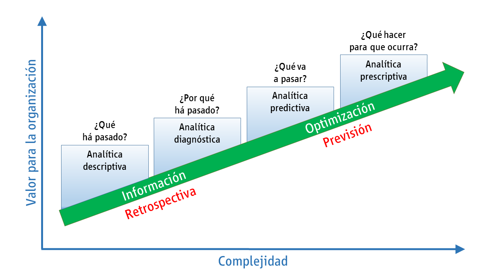

```{r setup, include=FALSE}
knitr::opts_chunk$set(echo = TRUE)
```


# ¿Qué es la Analítica de Datos?

La analítica de datos permite convertir datos sin procesar en información práctica, que permita tomar decisiones informadas. Esta se compone de distintas herramientas, tecnologías y procesos para encontrar tendencias, anomalías y resolver problemas haciendo uso de datos. En las últimas décadas hace parte de los procesos en las instituciones debido a las grandes ventajas que genera.  Por ejemplo, a través de esta se puede optimizar los servicios, identificar nuevas oportunidades de negocio, asegurar la confidencialidad y la calidad de los datos, proponer soluciones a los problemas que puedan surgir y en general, mejorar la productividad

En la analítica de datos, hay varios conceptos, dentro de estos está la minería de datos. En este último, confluyen tres elementos fundamentales:

- Datos: Son observaciones (números, imágenes, señales, ppalabras, etc) crudas que generalmente no tienen mucho significado por sí solas. 

- Información: Se obtiene al organizar, estructurar y contextualizar los datos. Es cuando los datos cobran significado y se vuelven útiles para comprender situaciones o tomar decisiones.

- Conocimiento: Va un paso más allá, implica interpretar la información para comprender las relaciones, patrones o implicaciones detrás de ella. El conocimiento se usa para obtener ideas valiosas o hacer predicciones en los contextos.

# Minería de Datos en el Análisis de Datos

Este proceso de la analítica de datos, permite descubrir patrones, relaciones o información oculta dentro de grandes conjuntos de datos, que generan valor para las organizaciones o campos específicos.  
Es decir, la minería de datos transforma datos sin procesar en información significativa y procesable. 
Se implementa haciendo uso de técnicas descriptivas y predictivas del análisis multivariado, como el aprendizaje automático (machine learning), la estadística y la inteligencia artificial.


## Algunas aplicaciones de la análitica de datos

Debido a que los datos están en todo, podría decirse que la analítica también.  A continuación, listamos, algunos casos de aplicación: 


- **Marketing y Publicidad**: Analizar datos de clientes para comprender sus preferencias, comportamientos de compra y segmentar el mercado para campañas más efectivas.

- **Salud**: Utilizar datos médicos para identificar patrones de enfermedades, predecir epidemias, personalizar tratamientos y mejorar la gestión hospitalaria.

- **Finanzas**: Analizar datos financieros para detectar fraudes, predecir tendencias del mercado, optimizar carteras de inversión y evaluar riesgos.

- **Ciencia e Investigación**: Usar datos científicos para modelar fenómenos naturales, descubrir nuevos medicamentos, entender el cambio climático, entre otros.

- **Manufactura y Operaciones**: Optimizar la cadena de suministro, predecir fallas en equipos, mejorar la eficiencia de la producción y reducir costos.

- **Recursos Humanos**: Analizar datos de empleados para mejorar la retención, identificar talentos, hacer predicciones de rotación y crear entornos laborales más productivos.


Empresas como Google, Facebook, Amazon, han basado su estrategia empresarial sobre el concepto del Big Data (Revuelta Bayod, 2018) y por ende de la mineria de datos. 

Por ejemplo, la empresa Amazon ha aumentado de manera
importante sus ventas, además, ha logrado reestructurar completamente su estrategia de negocios.
Mediante esta tecnología, el proceso de estar en contacto con los clientes la empresa se ha innovado y evolucionado de manera constante, hasta poder indicar que el conocimiento mismo de los consumidores es la clave del éxito de Amazon.
Gracias a distintos algoritmos complejos, Amazon ha personalizado completamente el proceso de compra, habilitando a cada usuario vea contenidos específicos y adaptados a sus gustos cuando utiliza el sitio. La frase de "los clientes interesados en este producto también compraron esto" es, en efecto, un recurso bien aprovechado por herramientas de Big Data.

## ¿Qué es y qué no es la analítica de datos?

Como enfatizamos anteriormente, la analítica de datos es el proceso de examinar datos para encontrar patrones, tendencias, correlaciones o cualquier otra información significativa que pueda ayudar a las organizaciones a tomar decisiones, cuyo objetivo principal es obtener información valiosa a partir de los datos para ayudar a las empresas y organizaciones a tomar decisiones informadas y estratégicas.
En esta se hace uso de herramientas y técnicas estadísticas, matemáticae y de análisis de datos.  Dependiendo del problema en el ciclo de los datos, esta podría clasificarse como descriptiva, diagnóstica, predictiva y prescriptiva. A continuación, presentamos una imagen de la clasificación, sin emabrgo, no ahondaremos en cada una de ellas. A lo largo de este curso, estaremos abordandolas.

<p style = 'text-align:center;'>

Tomado de: https://www.issa.int/es/analysis/use-analytical-technology-social-security-systems-during-pandemic

Sin embargo, la analítica de datos, no es sólo la recolección de datos, ni está limitada a un sólo campo o sector empresarial. Tampoco es una solución mágica y no sólo es aplicable para grandes empresas.

A continuación, se presentan una serie de situaciones, en las cuales, se busca que identifiquemos el impacto de la analítica de datos. 

## Caso 1
En las redes sociales, una empresa decide examinar las publicaciones de sus usuarios para determinar si hay favoristismo por cierta marca, producto o servicio. 

### Pregunta 
¿corresponde esto a un modelo dentro de la analítica de datos? Verdadero/falso

Verdadero, porque la empresa puede usar análisis de sentimientos para cuantificar dentro de cada comentario el sentimiento de preferencia.  (esta es la correcta)

Verdadero, porque la emporesa puede contar el número de menciones en redes sociales sin comprender el sentimiento detrás de esas menciones.

Falso, los sentimientos y las preferencias con una emoción que no se puede medir.


## Caso 2
Una entidad financiera, quiere ofrecer una nueva campaña ofreciendo su nuevo producto crediticio "Seguro max" y decide no considerar sus preferencias, estilos de vida y diferencias en el nivel de ingreso. 

### Pregunta 
¿Cree que esto corresponde a una metodología apropiada de la analítica de datos?   (sí/no)

sí, porque la entidad financiera debe dividir la base de clientes en grupos más pequeños basados en comportamientos de compra, preferencias, historial de transacciones, y características demográficas.

Sí, porque es necesario tratar a todos los clientes de la misma manera sin considerar sus diferencias y preferencias individuales.

No, porque las variables pueden ayudar a segmentar los clientes y así ofrecer un producto adecuado a cada segmento.  (esta es la correcta)


## Conclusión

Existen una gran gama de aplicaciones donde la analítica de datos tiene un papel fundamental.  No olvidemos que cada problema puede tener un herramenta o juego de herramientas para aproximarlo, y hay que tener claro que la analítica de datos involucra una metología más completa que no es única.
No sólo es almacenar grandes cantidades de datos sin ningún plan o intención de analizarlos para obtener información.  Ni con esta se pretende crear informes estáticos que muestran datos históricos sin profundizar en las tendencias, causas subyacentes o implicaciones para el futuro. Ni consiste en especulación o toma de deiciones intuitiva en creencias personales o corazonadas. Tampoco es útil utilizar datos desactualizados o incompletos que no reflejan la situación actual de la empresa o del mercado.  No es es una solución universal ni única para todos los problemas de la emperesa sin considerar el contexto y la aplicación específica.

# ¿Qué es BIBA?

En la analítica de datos, este término significa Business Intelligence Business Analytics (BIBA).  Este concepto abarca tanto la visualización como la analítica avanzada de datos.
A continuación, vamos a describir más detalladamente este concepto:

## Inteligencia de Negocios (BI - Business Intelligence)

Son las tecnologías, aplicaciones y prácticas para la recopilación, integración, análisis y presentación de datos empresariales. Su objetivo principal es respaldar las decisiones de negocio basada en datos.  Es decir, esta se centra en transformar datos complejos en representaciones visuales claras y comprensibles. 

Entre sus características básicas se encuentran la accesibilidad a la información, el apoyo a la toma de decisiones y orientación al usuario final. A través de herramientas inteligentes es posible analizar datos, crear informes, mapas gráficos y resúmenes para proporcionar información de valor en tiempo real. Algunos ejemplos son:

**Dashboards Interactivos**
Los paneles de control o dashboards son una herramienta común en BI. Permiten a los usuarios ver de un vistazo el rendimiento clave de una empresa. Pueden incluir gráficos, tablas, indicadores de desempeño y más.

**Gráficos y Diagramas**
Se utilizan para representar tendencias, patrones y relaciones en los datos. Ejemplos comunes incluyen gráficos de barras, gráficos circulares, gráficos de líneas, mapas de calor, entre otros.

**Mapas Interactivos**
Muestra datos geoespaciales, lo que es útil para empresas con operaciones dispersas geográficamente. Puede ayudar a identificar áreas de alto rendimiento, mercados potenciales, etc.

**Análisis de Cohortes**
Ayuda a comprender el comportamiento de grupos específicos de clientes o usuarios a lo largo del tiempo. Esto es valioso para mejorar la retención y la lealtad del cliente.

Incluir estos tableros interactivos.
https://www.datdata.com/ejemplos

## ¿Cómo funciona el business intelligence? 

Antes de adentrarte en su proceso y funcionamiento, es importante que conocer cuáles son los componentes de la business intelligence.

Multidimensionalidad: la información proviene de diferentes fuentes, como hojas de cálculo o bases de datos, para que la herramienta pueda reunir información completa de bases sólidas y actualizadas. 

Minería de datos: para una adecuada clasificación de acuerdo con las actividades que le competen a tu empresa. Además, permite observar tendencias nuevas como comportamientos o cambios relevantes. 

Agentes: los softwares analizan los datos y necesidades de los usuarios y están programados para interpretar esa información. 
Date Warehouse: ayuda a centralizar la información para aquellos que se encargan de la toma de decisiones. 

El proceso de la business intelligence puede dividirse en diferentes fases: 

- Dirigir y planear: en primer lugar, se debe definir los requerimientos de la empresa. Para ello se solicita a un grupo de analistas formular preguntas e hipótesis que ayuden a alcanzar los objetivos y necesidades de la compañía, de acuerdo con un plan estratégico o plan operativo anual.

- Recolectar información: esta se debe almacenar en bases de datos, sin importar de qué fuente provengan. Esto tiene la finalidad de obtener los resultados esperados.

- Procesar datos: los datos recolectados deben integrarse en un mismo formato para que puedan ser analizados. 

- Analizar y producir: en esta fase se crean reportes personalizados para saber cuáles son las opciones o acciones a seguir. En este mismo paso, podrán obtenerse indicadores relevantes para la toma de decisiones. 

- Difundir información: se generan los reportes de los datos analizados y procesados para que puedan ser interpretados. Una vez culminada dicha interpretación, se trazan las acciones a seguir y empiezan a llevarse a cabo. 

La inteligencia de negocios debe ser vista como un proceso lineal en el que, con base en los objetivos de la empresa, las preguntas sean respondidas a través de las acciones u opciones a seguir considerando los datos que se vayan obteniendo. 

### ¿business intelligence es big data?

A pesar de la popularidad del tema de la inteligencia de negocios, aún genera dudas y confusiones. En particualr se confunde con el término big data. Si bien la business intelligence y big data tienen ciertas similitudes, como el análisis de datos para su aprovechamiento, también cuentan con diferencias relacionadas con la función y almacenamiento. 

A continuación, planteamos algunas preguntas que nos ayudanrán a diferenciar ambos términos.

**¿Qué datos analiza?** La inteligencia de negocios analiza datos ya estructurados, orientados hacia el pasado; mientras que la big data puede hacer este mismo análisis, pero también de aquellos datos que no han sido estructurados. 

**¿Dónde almacena los datos?** La inteligencia de negocios almacena los datos recolectados en un servidor central; la big data en diferentes archivos distribuidos. 

**¿Qué hace con los datos que recolecta?** La inteligencia de negocios estudia las estadísticas internas de una organización y corrige errores operativos; la big data únicamente captura y procesa información. 

**¿Quién trabaja con los datos analizados?** En el caso de los datos recolectados por la inteligencia de negocios, estos son trabajados directamente por el director de la empresa o líderes de proyectos y estrategias, como economistas o técnicos; la big data es atendida por matemáticos o ingenieros. 

En pocas palabras, la inteligencia de negocios ayuda directamente a la toma de decisiones y el big data para la identificación de patrones de los datos. 

## Analítica Avanzada (BA - Business Analytics)

La analítica avanzada va más allá de simplemente visualizar datos; implica el uso de modelos y algoritmos para obtener información predictiva y prescriptiva. 

El propósito del BA es aumentar la eficiencia y productividad del negocio al contextualizar los datos del mercado y darles un significado concreto. Por ello, con el Business Analytics se tiene ventajas y beneficios tales como: 

- Tomar decisiones basadas en datos económicos, sociales, tecnológicos, de mercado, etc.
- Planear un mejor marketing digital en ventas.
- Reducir errores y costos operativos/de producción.
- Predecir posibles fallas en las maquinarias que se usen.
- Controllar totalmente un proceso de producción.

Aquí hay algunos enfoques comunes dependiendo de la gestión de datos.  

**Análisis descriptivo**

Se refiere al resumen o interpretación de los datos históricos de un negocio de modo que se tenga un panorama general que permita identificar patrones o tendencias internas.

**Análisis de diagnóstico**

Se centra en los datos pasados, para definir el porqué del rendimiento obtenido hasta el momento, pero sin analizar la situación actual. 

**Análisis predictivo**

Este análisis toma como base los resultados del análisis descriptivo para predecir resultados futuros usando estadística y machine learning.

**Análisis prescriptivo**

Su base son los datos de rendimiento y tiene como objetivo hacer recomendaciones mejorar resultados futuros. Es especialmente útil para resolver necesidades de los consumidores en tiempo real.

En resumen, la BIBA combina la visualización de datos para comprender el presente con la analítica avanzada para predecir el futuro y tomar decisiones estratégicas basadas en datos. 

-- El BI se centra en datos pasado y actuales (descriptivo), mientras que el BA busca predecir comportamientos o resultados futuros (predictivo). 

--El BI aporta a las estrategias de marketing digital en el presente; el BA ayuda a establecer un objetivo de marketing digital a futuro. 

-- El BI transforma la información del BA en decisiones comerciales estratégicas.   

Los expertos en BI deben comprender el detalle interno del negocio, mientras que los expertos en BA deben, además de entender el negocio, tener la capacidad de analizar todas las proyecciones y variables del mercado.

Finalmente, ambos procesos se sustentan en el análisis de datos y buscan ayudar a mejorar la toma de decisiones, para que el negocio se base en datos y no conjeturas. Al utilizar el Business Intelligence y el Business Analytics como complementos se logra tener un panorama completo, tanto de cómo funciona tu empresa al interior, como inserta en su propio contexto. 

# **ACTIVIDAD**

Analítica de negocios -BI-

- Interpretación de Gráficos
Observa el siguiente gráfico de barras que muestra las ventas trimestrales de una tienda de ropa durante el último año.


Preguntas:

¿Cuál fue el trimestre con las ventas más altas?
¿Hay algún trimestre que muestre una disminución en las ventas respecto al trimestre anterior?
¿Qué conclusiones puedes sacar de este gráfico en relación con las temporadas de venta?

- Comparación de Indicadores Clave

Observa los siguientes dos dashboards:

Dashboard A: Rendimiento de ventas por región.
Dashboard B: Tasa de conversión de ventas por canal de marketing.


Preguntas:

¿En qué región se registraron las mayores ventas según el Dashboard A?
¿Qué canal de marketing tuvo la tasa de conversión más alta según el Dashboard B?
¿Puedes identificar alguna correlación entre los datos de ambos dashboards?

- Análisis de Tendencias

Observa el siguiente gráfico de líneas que muestra el tráfico mensual de un sitio web durante el último año.


Preguntas:

¿Qué meses muestran picos de tráfico en el sitio web?
¿Hay alguna tendencia de crecimiento o decrecimiento en el tráfico a lo largo del año?
¿Cómo podrían utilizar esta información para planificar campañas de marketing?


Analítica Avanzada -BA-

- Predicción de Ventas

Observa los siguientes datos de ventas trimestrales y utiliza la tendencia para predecir las ventas del próximo trimestre.

Trimestre	Ventas ($)
T1	5000
T2	6000
T3	7000
T4	8000

Pregunta:

Basándote en la tendencia, ¿cuál sería tu predicción para las ventas del próximo trimestre (T5)?

- Segmentación de Clientes

Observa los siguientes datos de clientes y agrúpalos en segmentos basados en sus preferencias de productos y ubicación.

Cliente	Edad	Producto Preferido	Ubicación
Cliente 1	35	Ropa	Ciudad A
Cliente 2	28	Electrónica	Ciudad B
Cliente 3	45	Ropa	Ciudad A
Cliente 4	30	Ropa	Ciudad B
Cliente 5	40	Electrónica	Ciudad A

Pregunta:

¿Cómo podrías segmentar a estos clientes en grupos para personalizar las ofertas?

- Análisis de Series Temporales

Observa el siguiente gráfico de series temporales que muestra la evolución del precio de una acción durante los últimos 6 meses.


Preguntas:

¿Qué patrones puedes identificar en la evolución del precio de la acción?
Basándote en estos patrones, ¿crees que el precio de la acción aumentará o disminuirá en el próximo mes?

