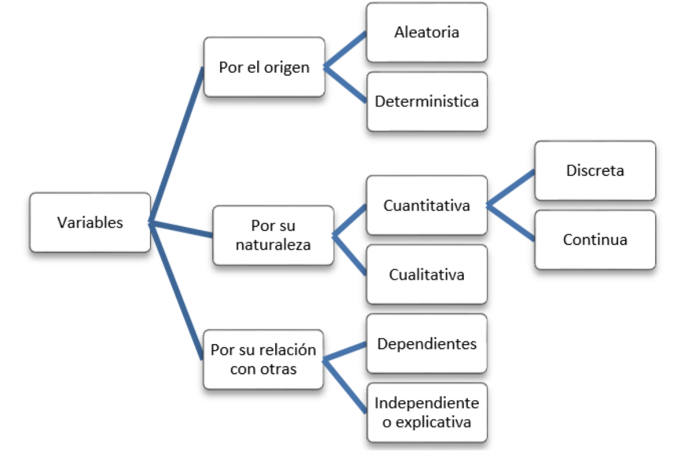
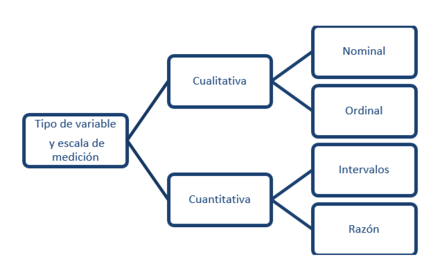

```{r setup, include=FALSE}
knitr::opts_chunk$set(echo = TRUE)
# Colores - paleta de azules
c1="#001A33"
c2="#003366"
c3="#004080"
c4="#1A8CFF"
c5="#4DA6FF"
c6="#80BFFF"
c7="#B3D9FF"

# <span style="color:#001A33"> 

## <span style="color:#003366">  

### <span style="color:#004080">
### <span style="color:#1A8CFF">
### <span style="color:#4DA6FF">
### <span style="color:#80BFFF">
### <span style="color:#B3D9FF">

```

<br/><br/>

Las siguientes definiciones estan relacionadas con métodologia empleadas en el proceso de la información para la toma de decisiones como son CRISP-DM  (Cross-Industry Standard Process for Data Mining) o tambienTDSP (Team Data Science Process).


##  **Estadistica descriptiva**

Es una rama de la estadística que se centra en recopilar, organizar, resumir y presentar datos de manera informativa. Su objetivo principal es describir las características esenciales de un conjunto de datos, como tendencias, patrones, distribuciones y medidas de resumen, para ayudar a comprender y comunicar de manera efectiva la información contenida en esos datos.

<br/><br/>

## **Probabilidad**

Es una medida numérica que cuantifica la posibilidad de que un evento ocurra. 
Se expresa como un número entre 0 y 1, donde 0 significa que el evento no ocurrirá  y 1 significa que el evento es seguro que ocurra. Los valores intermedios representan diferentes niveles de posibilidad. Conformando una herramienta esencial en la estadística y en muchas áreas de la ciencia para la toma de decisiones informadas.

<br/><br/>

Enfoques:

### **Probabilidad clásica** 

$$P(A) = \dfrac{n(A)}{n(S)}$$  

donde: 

* $A$ es un evento, por ejemplo sacar dos al lanzar un dado. 
* $S$ es el conjunto de todos los valores que puede tomar el experimento aleatoro, en este caso el lanzamiento de un dado. 
* $n(A)$, el número de formas como puede ocurrir el evento $A$, en este caso : 1. y 
* $n(S)$: el número de elementos del espacio muestral, es decir el número de formas diferentes como puede resultar el lanzamiento de un dado (6).
  
  $$P(A) = \dfrac{1}{6}$$
<br/><br/>

### **Probabilidad frecuentista** :  

$$P(A) = \lim_{n  \to \infty}\dfrac{\text{número de veces que ocurre A}}{\text{tamaño de la muestra}}$$

En este caso la probabilidad se estima tomando una muestra de tamaño $n$ y calculando la razón entre el número de veces en que se cumple el evento y el tamaño de la muestra. Este valor constituye un limite que converge a un valor que constituye la probabilidad.

Por ejemplo : la probabilidad que un cliente termine de pagar cumplidamente un crédito. Para ello se pueden obtener de la información disponible el número de clientes que han terminado el pago de sus creditos de manera cumplida sobre el total de clientes del banco.

<br/><br/>

### **Probabilidad subjetiva** : 

$$P(A) \gets \text{Experto}$$
En este caso la probabilidad es valorada y asignada por un experto. 


<br/><br/>

## **Variable aleatoria**

Una variable aleatoria es una caracteristica o atributo que puede tomar diferentes valores, distinta naturaleza 


el resultado de experimento aleatorio del cual auque se conosca los posibles resultados no se tiene certeza de cual de ellos finalmente se produzca. Por lo general estan asociadas a la medición o el conteo asignado a una caracteristica de un objeto o persona.


<br/><br/>

## <span style="color:#004080">**Tipos de variables**</span>

<br>

Las variables se puede clasificar de acuerdo a su origen, su naturaleza o su relación con otras variables


```{r, echo=FALSE, out.width="80%", fig.align = "left"}

```
<br/><br/>

### **Por su origen** 

Una variable es **aleatoria** cuando los valores resultantes de una medición no son predecibles. Podría decirse que sus resultados se desconoce por completo. Si antes de medir, puede predecirse el valor que tendrá la variable, entonces se dice que ésta tiene carácter **determinístico**.


### **Por su naturaleza**

Una variable es **cuantitativa** si denota características cuyos valores pertenecen al conjunto de los reales, tales como edad, peso y el sueldo de los empleados o el tiempo de vida de un equipo electrónico. Estas variables cuantitativas, a la vez se pueden clasificar en **discretas** o **continuas**.

La variable es **discreta** cuando el conjunto de valores que toma la variable es finito o infinito
numerable y por lo general proceden del conteo como por ejemplo: número de hijos por familia, el número de transaciones registradas en un dia, número de clientes atendidos en una hora, presentando como expresión inicial "número de".

Una variable es **continua** cuando el conjunto de valores que puede tomar la variable
corresponde a un intervalo o a la unión de intervalos. Por lo general este tipo de variables estan relacionadas con la medición, como por ejemplo el peso de una persona, el interes generado por un CDT.  Estas  variagbles puede tomar cualquier valor en un intervalo de pesos determinado.

### **Por su relación con otras variables** 

Es frecuente que un estudio tenga por objetivo describir el comportamiento de una variable específica a partir de otras variables. Por ejemplo, El kilometraje de un auto puede informar sobre el tiempo de vida de dicho auto. En este caso, se habla de variables **dependientes** e **independientes**.

<br/><br/>

### **Escalas de medición**

De acuerdo a su naturaleza las variables se pueden medir de acuerdo a las siguientes escalas: 

```{r, echo=FALSE, out.width="80%", fig.align = "left"}

```
<br/><br/>


####  **Nominal**

Corresponde a valores* **no numéricos** sin presencia de orden entre ellos. Solo es posibles  la comparación de dos valores mediante la igualda o desegualdad :

* Dos empleados tienen el mismo cargo  o sus cargos son diferentes. Por tal razón la variable **cargo** es una variable cualitativa en escala **nominal**.


####  Ordinal

Corresponde a valores **no numéricos** con presencia de orden entre ellos. Es posible realizar las comparaciones de dos valores y afirmar que  son iguales, diferentes, que un representa un nivel menor o mayor que el otro.

* La **evaluación del dempeño** de un empleado puede ser valorada como : Excelente, Muy buena, Buena, Regular, Muy Regular


####  De intevalo 

Corresponde a valores **numéricos**, dentro de los cuales solo tiene sentido la diferencia entre dos de sus valores. Podemos afirmar al comparar dos resultados que son iguales, diferentes, menor, mayor, tiene sentido la diferencia y el valor de cero no implica ausencia de la variable.

Como ejemplo de este tipo de escala tenemos la **temperatura** se pueden medir con varias escalas como: 

* Celsius $^{\circ} C$, (La escala Celsius fue creada  Andrés Celsius (1742) . Esta escala  tiene como referencia los puntos de congelación y ebullición del agua, límites que divide en 100 partes iguales 
*  Kelvin $K$, Creada por William Thompson Kelvin (1848), en la que propone una transformación de la escala Celsius hasta un valor  hipotético en el que hay ausencia de calor. 
* Fahrenheit $^{\circ}F$  Escala propuesta Gabriel Daniel Fahrenheit (1724), proponiendo una modificación a la escala Celsius
En conclusión la variable temperatura se puede medir en varias escalas

En ocasiones variables de tipo cualitativo no observables de manera directa como : Clima laboral,
Estrés, Inteligencia, Nivel de desempeño, Calidad, llamadas tambien **variables anteriores** debido a que su medición no es directa, sino que se realiza a través de preguntas que se recogen en un instrumento en muchos casos agrupados por factores. Cada respuesta en las preguntas tiene un valor o puntaje que es sumado y determina los niveles de la variable.  Los valores dados  a  las respuestas pueden cambiar de instrumento a instrumento, pues existen escalas con 3 valores, otras con 5, 7 que que pueden representar una escala ordinal. A esta transformación numérica (suma de los puntajes obtenidos al totalizar los puntajes obtenidos) se conoce como **operacionalización** a escala de intervalo de una variable cualitativa, facilitando su interpretación.  


####  **De razón**

Corresponde a valores  **numéricos**, para los cuales además de la disigualdades ($=$, $\neq$, $<$,$>$), tiene sentido la razón de dos de sus valores.  Al comparar dos resultados de una variable cuantitativa de razón. 

De este tipo de escala son por ejemplo : edad, sueldo, tiempo de atención, tiempo de respuesta, peso de un equipo portatil.

<br/><br/>

### **Respuesta o dependientes y explicativas o regresoras**

La variable **respuesta** o **dependiente** corresponde a la variable que se estás tratando de predecir o pronosticar a partir de un modelo estadístico. Los valores de esta variable dependen o son influenciados por otras variables en el análisis. 

Las variables **explicativas**, también llamadas variables **independientes**o **regresoras**, son aquellas que se utilizan para explicar o predecir las variaciones en la variable respuesta. Son las variables que se consideran como posibles factores que pueden influir en la variable respuesta.

Existe una relación entre la demanda de un bien y su precio, en este caso se puede construir un modelo que permita estimar la demanda de un bien (variable dependiente) a partir de su precio (variable independiente)


<br/><br/>

## **Inferencia Estadística**

Es el proceso mediante el cual se hacen generalizaciones sobre una población basándose en la información recopilada de una muestra de esa población. Este proceso implica el uso de metodos y tecnicas estadísticas relacionadas con la selección de una muestra representativa, la estimación de una caracteristica de la población o la evaluación de una afirmación sobre una caracteristica de la población que realiza a través de una prueba de hipótesis.


<br/><br/>

##  **Población**
<br/><br/>


<br/><br/>

## **Censo**

<br/><br/>

##  **Parámetro**

<br/><br/>

## **Muestra**


<br/><br/>

## **Estimador**


<br/><br/>


<br/><br/>

### **Muestreo**


<br/><br/>

###  **Pensamiento estadístico**

