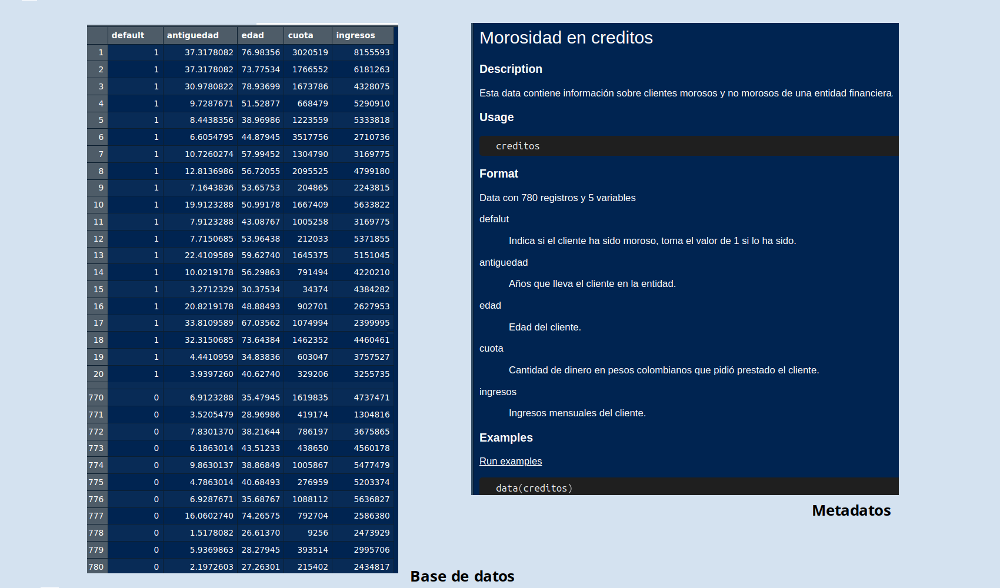

```{r setup, include=FALSE}
knitr::opts_chunk$set(echo = TRUE)
# Colores - paleta de azules
c1="#001A33"
c2="#003366"
c3="#004080"
c4="#1A8CFF"
c5="#4DA6FF"
c6="#80BFFF"
c7="#B3D9FF"

# <span style="color:#001A33"> 
## <span style="color:#003366">  

### <span style="color:#004080">
### <span style="color:#1A8CFF">

### <span style="color:#4DA6FF">
### <span style="color:#80BFFF">
### <span style="color:#B3D9FF">

```

<br/><br/>

## <span style="color:#004080">**Datos**</span>

Se refieren a los valores, observaciones o información que se recopilan, registran o miden en relación con una o más variables. Los datos son esenciales para el análisis estadístico, ya que son la base sobre la cual se construyen modelos, se hacen inferencias y se extraen conclusiones.

Se pueden presentar en diferentes formatos, como : valores, tablas, gráficos, diagramas. En el análisis estadístico, los datos se utilizan para calcular medidas descriptivas (como la media, la mediana, la moda), realizar análisis de tendencias, establecer relaciones entre variables, realizar pruebas de hipótesis y hacer inferencias sobre una población más amplia en función de una muestra.

<br/><br/>

### <span style="color:#686868">**Nota**</span>:

No confundir con el concepto de variable

*  Variable: edad
*  Dato : 25 años

<br/><br/>

## <span style="color:#004080">**Base de datos**</span>

Una base de datos es una colección organizada de datos que se utilizan para realizar análisis estadísticos y estudios de investigación. Incluyen datos numéricos y categóricos, así como metadatos que describen los datos y su origen.

Puede proceder de información recogida en una encuestas, registros gubernamentales, datos económicos, de salud, de clientes, entre otros. Estos datos se recopilan, organizan y almacenan de manera que sean accesibles y útiles para investigadores, analistas y otros profesionales que necesitan realizar análisis estadísticos.


```{r, echo=FALSE, out.width="90%", fig.align = "center"}

```


Algunas características comunes de las bases de datos estadísticos incluyen:

<br/><br/>

### <span style="color:#1A8CFF">**Estructura organizada**</span>: 

Los datos se organizan en tablas o archivos, con filas que representan observaciones individuales y columnas que representan variables.

<br/><br/>

###  <span style="color:#1A8CFF">**Metadatos detallados**</span>: 

Se proporciona información detallada sobre cada variable, como su definición, unidades de medida y categorías posibles en el caso de variables categóricas.

<br/><br/>

###  <span style="color:#1A8CFF">**Documentación**</span>: 

Las bases de datos estadísticos suelen ir acompañadas de documentación que describe cómo se recopilaron los datos, cuál es su alcance y cómo se pueden interpretar.

<br/><br/>

### <span style="color:#1A8CFF">**Acceso y consulta**</span>: 

Las bases de datos estadísticos pueden tener interfaces en línea o ser accesibles a través de software de análisis estadístico. Permiten a los usuarios realizar consultas y obtener conjuntos de datos específicos para análisis.

<br/><br/>

### <span style="color:#686868">**Nota**</span>:

Las bases de datos pueden contener información que no se pueda procesar desde la estadística como son el nombre, telefono, dirección, cedula de ciudadania. Estas variables sirven para identificar al individuo en caso de ser requerido pero no se utilizan para el proceso estadístico

<br><br>

## <span style="color:#004080">**Problemas en los datos**</span>

Es común enfrentar una variedad de problemas y desafíos que pueden afectar la calidad, la validez  y la interpretación de los datos. Algunos de los problemas más comunes incluyen:

<br><br>

### <span style="color:#1A8CFF">**Valores Atípicos (Outliers)**</span>: 

Valores extremadamente altos o bajos en un conjunto de datos pueden distorsionar las medidas de tendencia central y afectar las conclusiones. Es importante identificar si los valores atípicos son errores de medición o representan casos genuinos.

<br><br>

### <span style="color:#1A8CFF">**Datos Faltantes**</span>: 

La falta de datos en algunas observaciones puede llevar a la pérdida de información y a la distorsión de los resultados. La forma de tratar los datos faltantes debe hacerse cuidadosamente para no sesgar los resultados.

<br><br>

### <span style="color:#1A8CFF">**Sesgo de Selección**</span>: 

Cuando los datos se recopilan de manera no aleatoria o la muestra no es representativa de la población, puede introducirse un sesgo en los resultados y conclusiones.

<br><br>

### <span style="color:#1A8CFF">**Correlación no Implica Causación**</span>:

Aunque dos variables puedan estar correlacionadas, no necesariamente significa que una causa la otra. La relación puede ser influenciada por otras variables no consideradas.

<br><br>

### <span style="color:#1A8CFF">**Endogeneidad**</span>:

En estudios observacionales, la endogeneidad ocurre cuando una variable explicativa está correlacionada con el término de error del modelo. Esto puede sesgar los resultados y llevar a conclusiones erróneas.

<br><br>

### <span style="color:#1A8CFF">**Colinealidad**</span>: 

La colinealidad ocurre cuando dos o más variables explicativas en un modelo de regresión están altamente correlacionadas entre sí. Esto puede dificultar la interpretación de los coeficientes y la identificación de la contribución individual de cada variable.

<br><br>

### <span style="color:#1A8CFF">**Suposiciones Incumplidas**</span>: 

Muchos métodos estadísticos tienen suposiciones subyacentes (como la normalidad de los residuos en la regresión). Si estas suposiciones no se cumplen, los resultados pueden ser inexactos.

<br><br>

### <span style="color:#1A8CFF">**Efectos de Confusión**</span>: 

En estudios observacionales, los efectos de confusión ocurren cuando una tercera variable no considerada afecta tanto a la variable explicativa como a la respuesta, lo que puede conducir a resultados engañosos.

<br><br>

### <span style="color:#1A8CFF">**Tamaño de Muestra Insuficiente**</span>: 

Un tamaño de muestra pequeño puede resultar en estimaciones imprecisas y en la incapacidad de detectar efectos reales o diferencias significativas.

<br><br>


