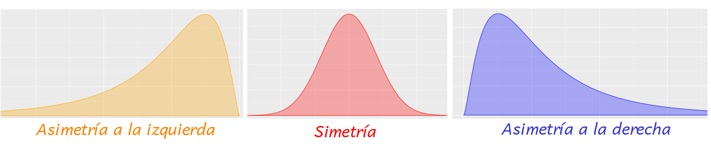

```{r setup, include=FALSE}
knitr::opts_chunk$set(echo = TRUE)
# Colores - paleta de azules
c1="#001A33"
c2="#003366"
c3="#004080"
c4="#1A8CFF"
c5="#4DA6FF"
c6="#80BFFF"
c7="#B3D9FF"

# <span style="color:#001A33"> 

## <span style="color:#003366">  

### <span style="color:#004080">
### <span style="color:#1A8CFF">
### <span style="color:#4DA6FF">
### <span style="color:#80BFFF">
### <span style="color:#B3D9FF">

```

<br><br>

Los indicadores de forma y simetría son herramientas estadísticas utilizadas para explorar las características fundamentales de una distribución de datos. Estos indicadores permiten comprender cómo los datos se agrupan o dispersan en relación con un punto central, como la media. Además, ayudan a revelar si los datos están equilibrados o muestran asimetrías notables. 

Esta información es esencial para evaluar la naturaleza y las propiedades de los datos, lo que a su vez respalda la toma de decisiones.

<br><br>

## **Curtosis**


Este indicador mede de la "agudeza" de la distribución de datos. Indica cuán concentrados o dispersos están los datos en relación con la media. Un valor de curtosis positivo indica una concentración de datos en torno a la media, lo que se conoce como una distribución leptocúrtica. Un valor negativo de curtosis indica una distribución aplanada con datos dispersos, lo que se llama una distribución platicúrtica. Una curtosis de 0 indica una distribución normal.


<br><br>

```{r, echo=FALSE, fig.height=3, fig.width=9, warning=FALSE, message=FALSE}
library(ggfortify)

# Crear el gráfico de densidad
p = ggdistribution(dnorm, seq(-5, 5, 0.01), mean = 0, sd = 1, colour = 'blue')

# Agregar el texto "Mesocúrtica"
p = p + annotate("text", x = 1.5, y = 0.3, label = "Mesocúrtica", color = "blue")

# Crear el gráfico de densidad
p = ggdistribution(dnorm, seq(-5, 5, 0.01), mean = 0, sd = 0.7, colour = 'red', p = p)

# Agregar el texto "Leptocúrtica"
p = p + annotate("text", x = -1.5, y = 0.45, label = "Leptocúrtica", color = "red")

# Crear el gráfico de densidad
p = ggdistribution(dnorm, seq(-5, 5, 0.01), mean = 0, sd = 1.5, colour = 'orange', p = p)

# Agregar el texto "Platicúrtica"
p = p + annotate("text", x = 3, y = 0.1, label = "Platicúrtica", color = "orange")

p
```
<br><br>

## **Sesgo o asimetria**

Este indicador se refiere a la asimetría de la distribución de datos. Un valor positivo de sesgo indica que la distribución tiene una cola larga hacia la derecha, lo que significa que hay valores atípicos por encima de la media. Un valor negativo de sesgo indica una cola larga hacia la izquierda, lo que sugiere valores atípicos por debajo de la media. Un sesgo de 0 indica que la distribución es simétrica en torno a la media.


```{r, echo=FALSE, out.width="90%", fig.align = "center"}

```

<br><br>

Elementos que pueden ayudar a la interpretación del indicador

+ **Asimetria negativa o a la izquierda ** : Poco con poco, mucho con mucho
+ **Simetrica** : Poco con poco, poco con mucho, mucho al rededor de un centro
+ **Asimetria positiva o a la derecha** : Mucho con poco, poco con mucho

<br><br>

### **Ejemplo**

Suponta que se realizan tres pruebas de conocimiento, la primera presenta una asimetría negativa o a la izquierda, la segunda una simetria y por último la tercera con una asimetría positiva o a la derecha.

Se puede interpretar que en la primera prueba (asimetria a la izquierda), pocos evaluandos obtuvieron resultados bajos y muchos sacaron puntajes altos, denotando así que la prueba fue relativamente facil

En el segundo caso de la prueba con resultados simetrocos, significa que pocos presentaron resultados bajos, la mayoria sacaron puntajes medios y que pocos obtuvieron resultados altos. Por lo general las pruebas estandarizadas y tambien las de estado estan diseñanadas para que los resultados sean simetrocos

Por ultimo la tercera prueba que presentó resultados asimetricos a la derecha indica que una gran mayoria obtieron puntajes bajos y que solo unos pocos resultaron con resultados altos.


