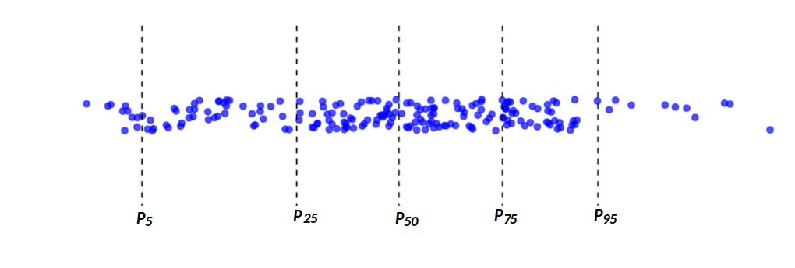
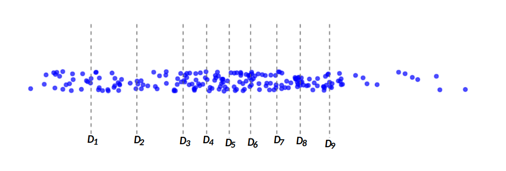
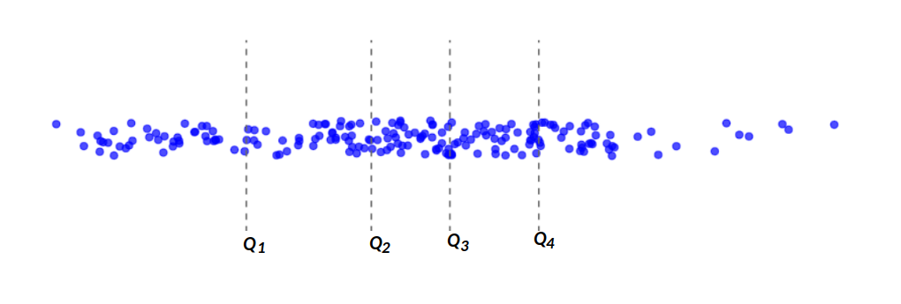

```{r setup, include=FALSE}
knitr::opts_chunk$set(echo = TRUE, comment = NA)
# Colores - paleta de azules
c1="#001A33"
c2="#003366"
c3="#004080"
c4="#1A8CFF"
c5="#4DA6FF"
c6="#80BFFF"
c7="#B3D9FF"

# <span style="color:#001A33"> 

## <span style="color:#003366">  

### <span style="color:#004080">
### <span style="color:#1A8CFF">
### <span style="color:#4DA6FF">
### <span style="color:#80BFFF">
### <span style="color:#B3D9FF">

# Cargar la librería ggplot2
library(ggplot2)

# Generar datos continuos
set.seed(123)  # Para que los datos generados sean reproducibles
datos <- rnorm(30, mean = 42, sd = 6)
#round(datos,0)
# install.packages("learnr") # solo una vez
# install.packages("devtools") # solo una vez
# devtools::install_github("dgonxalex80/paqueteMODELOS")


library(paqueteMODELOS)
data(creditos)
id = sample(1:780, 200, replace = FALSE)
credit = creditos[id,]


```


<br><br>

Los indicadores de posición ayuda entender la ubicación de un dato con respecto al conjunto de ellos. Es necesario por tanto ordenar los datos de menor a mayor con el fin de poder indicar la posición de un dato en terminos relativos.

Son ellos :

<br/><br/>

## **mínimo**

Corresponde al valor más pequeño de un conjunto de datos. Para obtenerlo se ordenan los datos de menor a mayor. Al ser comparado con el resto de datos permite establecer si se trata de un dato atípico o extraño.


<br/><br/>

### **Ejemplo**

Los siguentes valores corresponde a una muestra de edades de una base de clientes de una entidad financiera, ordenados de menor a mayor


```{r, echo=FALSE}
#sort(round(credit$edad,0))
```


<pre>
30, 32, 32, 33, 33, 33, 33, 34, 34, 34, 35, 35, 35, 36, 36, 37, 37, 38, 38, 38, 38, 39, 39, 39, 39, 39, 40, 41, 
41, 41, 42, 42, 42, 42, 42, 42, 42, 43, 44, 45, 45, 45, 45, 45, 46, 46, 47, 47, 48, 48, 49, 49, 49, 50, 50, 50, 
51, 51, 51, 51, 51, 52, 52, 52, 52, 52, 52, 53, 53, 53, 53, 53, 53, 53, 54, 54, 54, 54, 55, 55, 55, 55, 55, 55, 
56, 56, 56, 56, 56, 57, 57, 57, 57, 57, 57, 57, 57, 57, 58, 58, 58, 59, 59, 59, 59, 59, 59, 60, 60, 60, 60, 60, 
60, 60, 60, 61, 61, 61, 61, 61 ,61, 61, 61, 61, 61, 62, 62, 62, 62, 63, 63, 63, 63, 64, 64, 64, 64, 65, 65, 65, 
65, 65, 65, 65, 65, 66, 66, 66, 67, 67, 67, 67, 68, 68, 68, 68, 68, 68, 68, 68, 68, 68, 68, 69, 69, 69, 69, 70, 
70, 71, 71, 71, 71, 71, 72, 72, 72, 72, 72, 72, 72, 73, 73, 74, 74, 74, 74, 74, 74, 76, 77, 78, 79, 82, 83, 84, 
85, 88, 88, 18
</pre>

```{r, echo=FALSE}
cat("valor mínimo : ",round(min(credit$edad),0))
```


```{r, echo=FALSE,fig.height=2}
# Crear un dataframe con los datos
data <- data.frame(edad = credit$edad)

# Encontrar el valor mínimo
min_value <- min(data$edad)

# Agregar una columna para indicar si es el valor mínimo
data$is_min <- data$edad == min_value

# Crear el gráfico de puntos superpuestos en una sola dimensión de forma horizontal sin etiquetas
ggplot(data, aes(x = edad, y = "")) +
  geom_jitter(aes(color = is_min), width = 0, height = 0.1, size = 2, alpha = 0.7) +
  scale_color_manual(values = c("blue", "orange")) +  # Configurar colores
  theme_void() +
  # Agregar etiqueta "min" junto al punto naranja
  annotate("text", x = min_value, y = 0, label = "min", color = "black", vjust = -1) +
  theme(legend.position = "none")  # Anular las leyendas


```


<br><br>

## **máximo**

Se referirse al valor más grande en un conjunto de datos o en una serie de números. Es una medida simple que indica el extremo superior de la escala de valores en un conjunto dado. Ayuda en la comprensión de la magnitud más alta de un conjunto de observaciones.


Es útil para identificar límites o restricciones en un conjunto de datos y para determinar si hay valores atípicos o excepciones que superan ciertos umbrales. 


<br/><br/>

```{r, echo=FALSE, fig.height=2}
# Crear un dataframe con los datos
data <- data.frame(edad = credit$edad)

# Encontrar el valor máximo
max_value <- max(data$edad)

# Agregar una columna para indicar si es el valor máximo
data$is_max <- data$edad == max_value

# Crear el gráfico de puntos superpuestos en una sola dimensión de forma horizontal sin etiquetas
ggplot(data, aes(x = edad, y = "")) +
  geom_jitter(aes(color = is_max), width = 0, height = 0.1, size = 2, alpha = 0.7) +
  scale_color_manual(values = c("blue", "orange")) +  # Configurar colores
  theme_void() +
  # Agregar etiqueta "max" junto al punto naranja
  annotate("text", x = max_value, y = 0, label = "max", color = "black", vjust = -1) +
  theme(legend.position = "none")  # Anular las leyendas

```


<br><br>


## **Percentiles**

Corresponden a indicadores estadísticos que dividen el conjunto de datos en 100 partes iguales, cada una equivalente al $1$%, y cada percentil representa el valor por debajo del cual cae una determinada proporción de los datos. Los percentiles son herramientas fundamentales para comprender la distribución y la posición de los datos en un conjunto de observaciones.

Son utilizados en la evaluación de desempeño en pruebas estandarizadas, el análisis de distribuciones de ingresos, la identificación de valores atípicos y la toma de decisiones en campos como la atención médica y la gestión empresarial. También se utilizan en la creación de gráficos de caja (`boxplot`) para visualizar la dispersión y la posición de los datos en una distribución.


Son entonces 99 números que dividen los datos en 100 partes de igual porcentaje : $P_1$, $P_2$, ........$P_99$

En este caso el percentil $50$ corresponde a la mediana, que divide los datos en dos partes iguales, con el $50$% de los valores por encima y el $50$% por debajo. 


Los percentiles más comúnmente utilizados incluyen : $P_5$,  $P_{25}$, $P_{50}$, $P_{75}$, $P_{95}$

<br><br>

```{r, echo=FALSE, fig.width=8, fig.height=2}
# # Crear un dataframe con los datos
# data <- data.frame(edad = credit$edad)
# 
# # Calcular los percentiles
# percentiles <- quantile(data$edad, probs = c(0.05, 0.25, 0.50, 0.75, 0.95))
# 
# # Crear un gráfico de puntos superpuestos en una sola dimensión de forma horizontal
# gg <- ggplot(data, aes(x = edad, y = "")) +
#   geom_jitter(width = 0, height = 0.1, size = 2, alpha = 0.7, color = "blue") +
#   theme_void()
# 
# # Definir etiquetas de los percentiles
# etiquetas_percentiles <- c("P5", "P25", "P50" , "P75", "P95")
# 
# # Anotar los percentiles con líneas verticales y etiquetas
# for (i in seq_along(percentiles)) {
#   gg <- gg +
#     geom_vline(xintercept = percentiles[i], linetype = "dashed", color = "black")# +
# #    geom_text(aes(x = percentiles[i], label = etiquetas_percentiles[i]), color = "black", vjust = -1, hjust = -0.5)
# }
# 
# # Anular las leyendas
# gg <- gg + theme(legend.position = "none")
# 
# gg


```


```{r, echo=FALSE, out.width="100%", fig.align = "center"}

```

<br/><br/>


## **Deciles**

Son 9 número que dividen los datos en 10 partes de igual porcentaje (10% cada uno)

$D_1$, $D_2$, $D_3$,$D_4$, $D_5$, $D_6$, $D_7$, $D_8$, $D_9$

El decil 3 divide en dos partes los datos: por debajo de el está un 30% de los datos, mientras el restante 70% se encuentra ubicado por encima.

```{r, echo=FALSE, fig.width=8, fig.height=2}
# # Crear un dataframe con los datos
# data <- data.frame(edad = credit$edad)
# 
# # Calcular los deciles
# deciles <- quantile(data$edad, probs = seq(0.10, 0.90, 0.10))
# 
# # Crear un gráfico de puntos superpuestos en una sola dimensión de forma horizontal
# gg <- ggplot(data, aes(x = edad, y = "")) +
#   geom_jitter(width = 0, height = 0.1, size = 2, alpha = 0.7, color = "blue") +
#   theme_void()
# 
# # Definir etiquetas de los deciles
# etiquetas_deciles <- c("P10", "P20", "P30", "P40", "P50", "P60", "P70", "P80", "P90")
# 
# # Anotar los deciles con líneas verticales y etiquetas
# for (i in seq_along(deciles)) {
#   gg <- gg +
#     geom_vline(xintercept = deciles[i], linetype = "dashed", color = "#686868") 
# }
# 
# # Anular las leyendas
# gg <- gg + theme(legend.position = "none")
# 
# gg

```


```{r, echo=FALSE, out.width="100%", fig.align = "center"}

```
<br><br>


<br/><br/>

## **Quintiles**

Son 4 números que dividen los datos en cinco parte de igual porcentaje, cada una de ellas con el 20% de los datos

$Q_1$, $Q_2$, $Q_3$, $Q_4$

Este indicador es muy utilizado en economía para representar los ingresos familiares, permitiendo evaluar la distribución de la riqueza. Tambien es empleado en educación para la evaluación de desempeño de estudiantes y en la segmentación de mercados entre las principales aplicaciones.


```{r, echo=FALSE, fig.width=8, fig.height=2}
# # Calcular los quintiles
# quintiles <- quantile(data$edad, probs = seq(0.20, 0.80, 0.20))
# 
# # Crear un gráfico de puntos superpuestos en una sola dimensión de forma horizontal
# gg_quintiles <- ggplot(data, aes(x = edad, y = "")) +
#   geom_jitter(width = 0, height = 0.1, size = 2, alpha = 0.7, color = "blue") +
#   theme_void()
# 
# # Definir etiquetas de los quintiles
# etiquetas_quintiles <- c("Q20", "Q40", "Q60", "Q80")
# 
# # Anotar los quintiles con líneas verticales y etiquetas
# for (i in seq_along(quintiles)) {
#   gg_quintiles <- gg_quintiles +
#     geom_vline(xintercept = quintiles[i], linetype = "dashed", color = "#686868") 
# }
# 
# # Anular las leyendas
# gg_quintiles <- gg_quintiles + theme(legend.position = "none")
# 
# gg_quintiles

```


```{r, echo=FALSE, out.width="100%", fig.align = "center"}

```


<br><br>

## **Cuartiles**


Son 3 números que dividen los datos en cinco parte de igual porcentaje, cada una de ellas con el 25% de los datos

$q_1$, $q_2$, $q_3$
<br><br>


```{r, echo=FALSE, fig.width=8, fig.height=2}

# Crear un dataframe con los datos
data <- data.frame(edad = credit$edad)

# Crear un gráfico de caja (boxplot) con los puntos superpuestos de forma horizontal
gg_boxplot_horizontal <- ggplot(data, aes(y = edad, x = " ")) +
  geom_boxplot(fill = "#3895D3", color = "#072F5F") +
  geom_jitter(height = 0.1, size = 2, alpha = 0.5, color = "#1261A0") +
  theme_void() +
  coord_flip()

gg_boxplot_horizontal


```

El diagrama de cajas o boxplot, se contruye con los cuartiles que se ubican en las lineas de la caja, siendo $q_1$ en inicio de la caja, $q_2$, la linea central de la caja y $q_3$ la linea que finaliza la caja.  

En el área represenada por la caja se encuentra el 50% de los datos en el restante 50% dividido en dos partes. Un 25% en la parte inferior y un 25% con los datos mayores.

Note que la linea inferior llega hasta el dato menor y la linea siperior hasta el dato mayor. Esto no ocurre siempre, pues cuando se presentan datos atipicos esto se represntan por fiera de la linea


```{r, echo=FALSE, fig.width=8, fig.height=2}

# Crear un dataframe con los datos
data <- data.frame(edad = credit$edad)
data$edad =c(30, 32, 32,33, 33, 33, 33, 34, 34,34, 35, 35, 35, 36, 36, 37, 37, 38,
             38, 38, 38, 39,39, 39, 39, 39, 40, 41, 41, 41, 42, 42, 42, 42, 42, 42,
             42, 43, 44, 45, 45, 45, 45, 45, 46, 46, 47, 47, 48, 48, 49, 49, 49, 50, 
             50, 50, 51, 51, 51, 51, 51, 52, 52, 52, 52, 52, 52, 53, 53, 53, 53, 53, 
             53, 53, 54, 54, 54, 54, 55, 55, 55, 55, 55, 55, 56, 56, 56, 56, 56, 57, 
             57, 57, 57, 57, 57, 57, 57, 57, 58, 58, 58, 59, 59, 59, 59, 59, 59, 60,
             60, 60, 60, 60, 60, 60, 60, 61, 61, 61, 61, 61 ,61, 61, 61, 61, 61, 62, 
             62, 62, 62, 63, 63, 63, 63, 64, 64, 64, 64, 65, 65, 65, 65, 65, 65, 65,
             65, 66, 66, 66,67, 67, 67, 67, 68, 68, 68, 68, 68, 68, 68, 68, 68, 68, 
             68, 69, 69, 69, 69, 70, 70, 71, 71, 71, 71, 71, 72, 72, 72, 72, 72, 72, 
             72, 73, 73, 74, 74, 74, 74, 74, 74, 76, 77, 78, 79, 82, 83, 84, 85, 88, 
             88, 18)
# Crear un gráfico de caja (boxplot) con los puntos superpuestos de forma horizontal
gg_boxplot_horizontal <- ggplot(data, aes(y = edad, x = " ")) +
  geom_boxplot(fill = "#3895D3", color = "#072F5F") +
  geom_jitter(height = 0.1, size = 2, alpha = 0.5, color = "#1261A0") +
  theme_void() +
  coord_flip()

gg_boxplot_horizontal


```

El punto en color más oscuro constituye un dato atípico que se detecta al trazar dos límites :


limite inferior = $Q_1 - 1.5 \times RIQ$
límite superior = $Q_3 + 1.5 \times RIQ$

Si alguno de los datos se encuentra por fuera de estos límites se denomina atípico


<br/>

