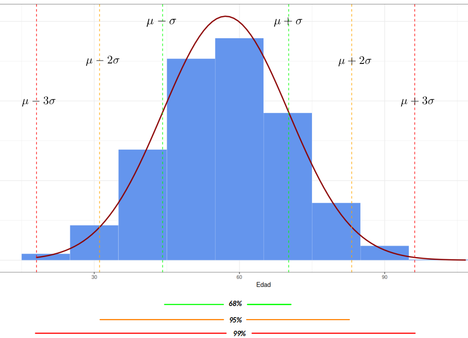

```{r setup, include=FALSE}
knitr::opts_chunk$set(echo = TRUE, comment = NA)
# Colores - paleta de azules
c1="#001A33"
c2="#003366"
c3="#004080"
c4="#1A8CFF"
c5="#4DA6FF"
c6="#80BFFF"
c7="#B3D9FF"

# <span style="color:#001A33"> 

## <span style="color:#003366">  

### <span style="color:#004080">
### <span style="color:#1A8CFF">
### <span style="color:#4DA6FF">
### <span style="color:#80BFFF">
### <span style="color:#B3D9FF">

# Cargar la librería ggplot2
library(ggplot2)

# Generar datos continuos
set.seed(123)  # Para que los datos generados sean reproducibles
datos <- rnorm(30, mean = 42, sd = 6)
#round(datos,0)

library(paqueteMODELOS)
data(creditos)
id = sample(1:780, 200, replace = FALSE)
credit = creditos[id,]


```

<br><br>

Este modelo de probabilidad fué planteada por el matemático francés del siglo 18, Abraham de Moivre, quien a partir de la distribución binomial, con $n=2$ empezó a aumentar su tamaño hasta observar que se formaba una distribución en forma de campana. Este mismo comportamiento fué detectado por Galileo en el siglo 17, al observar los errores producto de sus mediciones en astronomía. El modelo como se conoce actualmente fue propuesto de manera simultánea por los cientificos Robert Adrain y Carl Friedrich Gauss, quien finalmente le dió el nombre.

La distribución normal es uno de los modelos más utilizados en las aplicaciones de la Estadística. Estas aplicaciones están relacionadas con:

* La mayoría de variables en la naturaleza, se distribuyen aproximadamente de manera normal

* A partir de la distribución normal se originan las distribuciones $t-student$, $\chi^{2}$ y $F$-Fisher, utilizadas en inferencia estadística

* En general la media muestral de variables que no tienen distribución normal, tiende a aproximarse a una distribución normal, a medida que el tamaño de muestra aumenta. (Teorema del Límite Central) 


Su función de densidad esta dada por:

<br/>


## **Distribución normal**
	
$$f(x)= \dfrac{1}{\sqrt{2\pi \sigma^{2}}} \hspace{.1cm} e^{-\big(\frac{1}{2\sigma^{2}}(x-\mu)^{2}\big)}	 \hspace{.5cm}  -\infty \leq  x \leq \infty $$  
	
$$E[X]=\mu$$
$$V[X]=\sigma^{2}$$


<br/><br/>

En la siguente gráfica se muestra el efecto en la curva normal, producto de cambios en la media o en la varianza. A mayor valor de la media la curva se desplaza a la derecha, mientras que a menor varianza la curva se vuelve mas angosta o puntiaguda 

Distribuciones normales : <span style="color:blue">$N(0,1)$</span>, <span style="color:red"> $N(0,1.5)$</span> y <span style="color:orange"> $N(2,1.5)$</span>

```{r, echo=FALSE, fig.height=3.5, message=FALSE, warning=FALSE}
# Distribucion normal
library(ggfortify)

p=ggdistribution(dnorm, seq(-4, 8, 0.1), mean = 0, sd = 1,colour = 'blue')
p=ggdistribution(dnorm, seq(-4, 8, 0.1), mean = 0, sd = 1.5,colour = 'red', p=p)
ggdistribution(dnorm, seq(-4, 8, 0.1),   mean = 2, sd = 1.5,colour = 'orange', p=p)
# ggdistribution(dnorm, seq(-4, 8, 0.1),   mean = 1, sd = 2,colour = 'gray', p=p)
```


Dentro del sin número de posibles curvas que se pueden obtener con los parámetros $\mu$ y $\sigma^{2}$, existe una muy especial. Normal estándar ($N(0,1)$) con $\mu=0$ y $\sigma^{2}=1$.  La gran mayoría de libros de Estadística poseen tablas de la función de distribución acumulada de la normal estándar.\\


## **Distribución normal estandar N(0,1)**

Su función de distribución esta dada por :

$$f(x)= \dfrac{1}{\sqrt{2\pi}} \hspace{.1cm} e^{-\big(\frac{1}{2}(x)^{2}\big)}	 \hspace{.5cm}  -\infty \leq  x \leq \infty $$ 

Si $X \sim N(\mu, \sigma^{2})$, entonces $Z= \dfrac{X-\mu}{\sigma} \sim N(0,1)$ 

a este proceso se le llama comúnmente estandarizar.


**normal estándar**

```{r, echo=FALSE, fig.height=3.5}
library(ggfortify)
ggdistribution(dnorm, seq(-4, 4, 0.1), mean = 0, sd = 1,fill = '#1261A0')
```

<br/><br/>


La propiedad empírica de la distribución normal es de gran ayuda cuando una variable  de interés se  puede aproximar al modelo normal. Ella establece un intervalo formado por la media mas o menos una desviación estándar contiene el 68\% de los datos. Si el intervalo tiene un ancho de 4 desviaciones estándar contendrá el 95\% de los datos y si este intervalo corresponde a los valores de la media mas o menos 3 desviaciones estándar contendrá el 99\% de los datos que se representa en la siguiente gráfica.


## **Propiedad empírica de la distribución normal estandar**


```{r, echo=FALSE, out.width="70%", fig.align = "center"}
knitr::include_graphics("img/norm01.png")
```


* La regla empírica establece que:

*	Aproximadamente el 68\% de la población se encuentra en el intervalo centrado $$(\mu - \sigma ; \mu + \sigma)$$

* Aproximadamente el 95\% de la población se encuentra en el intervalo centrado $$(\mu - 2\sigma ; \mu + 2\sigma)$$

* Aproximadamente el 99.7\% de la población se encuentra en el intervalo centrado $$(\mu - 3\sigma ; \mu + 3\sigma)$$


### **Ejemplo**

```{r, echo=FALSE}
# library(ggplot2)
# 
# n <- 1000
# mean_val <- mean(credit$edad)
# sd_val <- sd(credit$edad)
# binwidth <- 10
# 
# set.seed(1)
# df <- data.frame(x = rnorm(n, mean_val, sd_val))
# 
# ggplot(df, aes(x = x, mean = mean_val, sd = sd_val, binwidth = binwidth, n = n)) +
#   theme_bw() +
#   geom_histogram(binwidth = binwidth, color = "white", fill = "cornflowerblue", size = 0.1) +
#   stat_function(
#     fun = function(x) dnorm(x, mean = mean_val, sd = sd_val) * n * binwidth,
#     color = "darkred",
#     size = 1
#   ) +
#   geom_vline(aes(xintercept = mean_val - sd_val), linetype = "dashed", color = "green") +
#   geom_vline(aes(xintercept = mean_val + sd_val), linetype = "dashed", color = "green") +
#   geom_vline(aes(xintercept = mean_val - 2 * sd_val), linetype = "dashed", color = "orange") +
#   geom_vline(aes(xintercept = mean_val + 2 * sd_val), linetype = "dashed", color = "orange") +
#   geom_vline(aes(xintercept = mean_val - 3 * sd_val), linetype = "dashed", color = "red") +
#   geom_vline(aes(xintercept = mean_val + 3 * sd_val), linetype = "dashed", color = "red") +
#   labs(title = "Histograma con Curva Normal y Rangos de Desviación Estándar",
#        x = "Edad",
#        y = "Frecuencia")

```

```{r, echo=FALSE, out.width="70%", fig.align = "center"}

```


