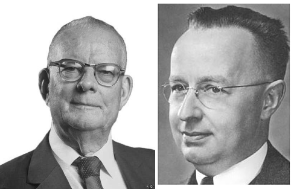

```{r setup, include=FALSE}
knitr::opts_chunk$set(echo = TRUE)
# Colores - paleta de azules
c1="#001A33"
c2="#003366"
c3="#004080"
c4="#1A8CFF"
c5="#4DA6FF"
c6="#80BFFF"
c7="#B3D9FF"

# <span style="color:#001A33"> 

## <span style="color:#003366">  

### <span style="color:#004080">
### <span style="color:#1A8CFF">
### <span style="color:#4DA6FF">
### <span style="color:#80BFFF">
### <span style="color:#B3D9FF">

```


<br/><br/>

>
"El ciclo PHVA (Planificar-Hacer-Verificar-Actuar), es un método iterativo para la mejora continua de la calidad. El ciclo comienza con la planificación de un cambio, luego se implementa el cambio, se verifica el efecto del cambio y finalmente se actúa sobre los resultados para estandarizar el cambio o realizar más mejoras."
>
Deming, W. E. (1986)

<br/><br/>

Es también conocido como ciclo  **Shewhart** o **Deming**, en honor a los pioneros de la gestión de la calidad, W. Edwards Deming y Walter A. Shewhart,


```{r, echo=FALSE, out.width="40%", fig.align = "center"}

```
<center>
<sub>
William Edwards Deming (1900-1993), Walter Andrew Shewhart (1891-1967)
</sub>
</center>


<br/><br/>

<!-------------------------------------------------------------------------- -->

El ciclo PHVA es fundamental para la mejora continua de la calidad, conformaqndo un método cíclico que se utiliza para identificar problemas, implementar soluciones, medir los resultados y realizar ajustes según sea necesario. También se conoce como ciclo Deming, en honor a W. Edwards Deming, quien lo popularizó en la década de 1950.

Las cuatro fases que componen el ciclo PHVA son:

**Planificar**: En esta fase, se identifican los problemas o áreas de oportunidad para la mejora. Se establecen objetivos específicos, medibles, alcanzables, relevantes y con un plazo determinado (SMART). Se desarrollan planes de acción detallados que describen las actividades que se llevarán a cabo para lograr los objetivos.

**Hacer**: En esta fase, se ponen en práctica los planes de acción desarrollados en la fase de planificación. Se recopilan datos e información necesaria y se monitorea el progreso.

**Verificar**: En esta fase, se analizan los datos recopilados durante la fase de ejecución para evaluar si se han logrado los objetivos. Se comparan los resultados reales con los resultados esperados.

**Actuar**: En esta fase, se toman medidas en función de los resultados de la fase de verificación. Si se han logrado los objetivos, se estandarizan los procesos exitosos y se documentan las lecciones aprendidas. Si no se han logrado los objetivos, se identifican las causas de los problemas y se realizan ajustes a los planes de acción.


Algunos beneficios del ciclo PHVA son :

* **Mejora continua de la calidad**: Ayuda a identificar y eliminar problemas de manera continua, lo que conduce a una mejor calidad de productos y servicios.

* **Reducción de costos**: La identificación y eliminación de problemas de manera temprana,  ayuda a reducir los costos del proceos o servicio.

* **Mayor eficiencia**: Ayuda  a mejorar la eficiencia de los procesos e identificar y eliminar cuellos de botella.

* **Mayor satisfacción del cliente** : Al mejorar la calidad de los productos o servicios,  mejora la satisfacción de los clientes.

* **Cultura de mejora continua**: Ayuda a crear una cultura de mejora continua en la organización.


```{r, echo=FALSE, out.width="50%", fig.align = "center"}
knitr::include_graphics("img/ciclo_PHVA.png")
```
<br/><br/>


El **PHVA** se utiliza ampliamente en la gestión de la calidad y se aplica en muchas áreas, incluyendo la gestión de proyectos, la gestión ambiental, la gestión de la seguridad, la gestión de la seguridad alimentaria y la gestión de la calidad en general. Es una herramienta efectiva para impulsar mejoras constantes en los procesos y productos, lo que conduce a una mayor eficiencia y satisfacción del cliente.

<br/><br/>

## **Ejemplo**

#### **1. Planificar (Plan)**  

Una entidad  financiera desea mejorar su proceso de revisión de solicitudes de préstamos para garantizar una mayor eficiencia y precisión en la toma de decisiones de aprobación de préstamos.

Para lograrlo se debe plantear las siguientes actividades:

* Definir los objetivos del proceso, como reducir el tiempo de revisión de solicitudes en un 20% y mejorar la precisión en la toma de decisiones.

* Formar un equipo de proyecto que incluya expertos en análisis de crédito, tecnología de la información y operaciones bancarias.

* Establecer un plan detallado que incluya acciones específicas, como la implementación de un sistema de puntuación crediticia automatizado y la revisión de los procedimientos de revisión de préstamos.

<br/><br/>

### **2. Hacer (Do)**

Para ejecutar lo planeado debe :

* Introducir un sistema de puntuación crediticia automatizado que agilice la revisión de solicitudes.

* Capacitar al personal en el uso del nuevo sistema y en la revisión de préstamos de acuerdo con los nuevos procedimientos.

* Recopilar datos durante la implementación para evaluar el rendimiento del nuevo sistema.

<br/><br/>

### **3. Verificar (Check)**

Después de realizar laa acciones debe:


* Comparar los datos de tiempo y precisión antes y después de la implementación para evaluar si se han logrado los objetivos.

* Realizar auditorías de calidad en una muestra de solicitudes de préstamos para asegurarse de que se sigan los procedimientos y se mantenga la precisión.

<br/><br/>

### **4. Actuar (Act)**

Basado en los resultados: 

* Toma decisiones basadas en los resultados de la fase de Verificación.

<br/><br/>

Despues de realizar el ciclo se evalua si los resultados muestran mejoras en los indicadores como el tiempo de revisión de solicitudes. En caso de presentarse mejoras significativas, las modificaciones implementadas se mantienen. En caso contrario se replantea nuevamente el ciclo 


<br/><br/>

# **Evaluación**

En una entidad financiera con presencia en varios países de Latinoamérica, ha detectado un aumento en la tasa de morosidad de los créditos hipotecarios en Colombia durante el último trimestre.

De acuerdo con el ciclo PHVA, ¿en qué etapa se encuentra el banco al realizar las siguientes acciones?

<br/>
<div class="content-box-blue">

**1.** Se reúne un equipo de expertos para analizar las causas del aumento en la morosidad de los créditos hipotecarios en Colombia.

a. Planificar
b. Hacer
c. Verificar
d. Actuar

</div>

<br/><br/>

-------------------------------------------------------------------------------

Respuesta : 

 * a.(V) **Planificar**: El banco se encuentra en la etapa de planificación al reunir un equipo de expertos para analizar las causas del aumento en la morosidad. En esta etapa se definen los objetivos, se identifican las causas del problema y se diseñan las soluciones.

* b.(F). La entidad "ha detectado"... , indica que se encuentra en una etapa preliminar a la acción

* c.(F). Esta etapa (Verificar) ocurre despues de haber realizado una acción

* d.(F). Se considera esta etapa (Actuar) como el cierre del proceso y no como el inicio.


-------------------------------------------------------------------------------

<br/><br/>
<div class="content-box-blue">

**2.** Se implementa un nuevo programa de educación financiera para los clientes que tienen créditos hipotecarios en Colombia.

a. Planificar
b. Hacer
c. Verificar
d. Actuar
</div>
--------------------------------------------------------------------------------

Respuesta:

* a. Planificar (F) : El "implentar" indica una acción que se realiza, por tanto no corresponde a esta etapa  

* b. **Hacer** (V): El banco se encuentra en la etapa de hacer al implementar un nuevo programa de educación financiera para los clientes que tienen créditos hipotecarios. En esta etapa se ponen en práctica las soluciones que se han diseñado.

* c. Verificar (F): El "implentar" indica una acción que se realiza, por tanto no corresponde a esta etapa  

* d. Actuar (F): El "implentar" indica una acción que se realiza, por tanto no corresponde a esta etapa  

--------------------------------------------------------------------------------

<br/><br/>
<div class="content-box-blue">
**3.** Se monitorea la tasa de morosidad de los créditos hipotecarios en Colombia durante los próximos seis meses para evaluar la efectividad del nuevo programa de educación financiera.

a. Planificar
b. Hacer
c. Verificar
d. Actuar

</div>
--------------------------------------------------------------------------------

Respuesta :

* a. Planificar (F) : El monitoreo corresponde a una acción de verificación, por tal razón no corresponde a esta etapa.

* b. Hacer (F) : El monitoreo corresponde a una acción de verificación, por tal razón no corresponde a esta etapa.

* c. **Verificar** (V): El banco se encuentra en la etapa de verificación al monitorear la tasa de morosidad de los créditos hipotecarios durante los próximos seis meses. En esta etapa se evalúa la efectividad de las soluciones que se han implementado.

* d. Actuar. (F) : El monitoreo corresponde a una acción de verificación, por tal razón no corresponde a esta etapa.

--------------------------------------------------------------------------------

<br/><br/>
<div class="content-box-blue">
**4.** Se decide modificar el programa de educación financiera para hacerlo más efectivo en la reducción de la morosidad de los créditos hipotecarios en Colombia.


a. Planificar
b. Hacer
c. Verificar
d. Actuar
</div>
--------------------------------------------------------------------------------

Solución:

* a. Planificar: (F): La acción de implementar o modificar corresponde a la etapa de actuar, formado parte de el final del proceso y no de esta etapa.

* b. Hacer(F): La acción de implementar o modificar corresponde a la etapa de actuar, formado parte de el final del proceso y no de esta etapa.
* c. Verificar (F): La acción de implementar o modificar corresponde a la etapa de actuar, formado parte de el final del proceso y no de esta etapa.

* d. **Actuar** (V) : El banco se encuentra en la etapa de actuar al decidir modificar el programa de educación financiera para hacerlo más efectivo. En esta etapa se toman medidas correctivas para mejorar los resultados.

