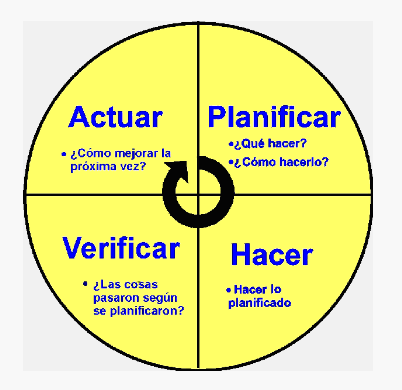

```{r setup, include=FALSE}
knitr::opts_chunk$set(echo = TRUE)
# Colores - paleta de azules
c1="#001A33"
c2="#003366"
c3="#004080"
c4="#1A8CFF"
c5="#4DA6FF"
c6="#80BFFF"
c7="#B3D9FF"

# <span style="color:#001A33"> 

## <span style="color:#003366">  

### <span style="color:#004080">
### <span style="color:#1A8CFF">
### <span style="color:#4DA6FF">
### <span style="color:#80BFFF">
### <span style="color:#B3D9FF">

```


<br/><br/>

El ciclo **PHVA** es un enfoque de gestión utilizado en la mejora continua de la calidad, la productividad y la eficiencia en una organización. PHVA son las siglas de Planificar, Hacer, Verificar y Actuar, y se refieren a las cuatro etapas clave del ciclo. También se conoce como el ciclo de Deming o el ciclo de Shewhart, en honor a los pioneros de la gestión de la calidad, W. Edwards Deming y Walter A. Shewhart.


<br/><br/>

```{r, echo=FALSE, out.width="50%", fig.align = "center"}

```
<br/><br/>

## **Planificar (Plan):** 

En esta etapa, se establecen los objetivos y metas a alcanzar, se identifican los procesos a mejorar y se diseñan planes de acción. Se definen los indicadores de rendimiento clave (KPIs) y se establecen las estrategias para lograr mejoras.

<br/><br/>

## **Hacer (Do):** 

En esta etapa, se implementan los planes y se ejecutan las acciones definidas en la etapa de planificación. Es importante seguir los procedimientos y protocolos establecidos, recopilar datos y llevar a cabo las actividades planificadas.

<br/><br/>

## **Verificar (Check):** 

En esta etapa, se realiza un seguimiento y una evaluación de los resultados obtenidos. Se recopilan datos, se comparan con los KPIs y se analizan para determinar si se han alcanzado los objetivos establecidos. Se identifican desviaciones o problemas.

<br/><br/>

## **Actuar (Act):** 

En función de los resultados y el análisis en la etapa de verificación, se toman medidas para corregir, mejorar y optimizar los procesos. Esto puede implicar ajustar los planes, realizar cambios en los procedimientos y tomar decisiones para prevenir problemas futuros.

<br/><br/>

Este ciclo no es lineal, lo que significa que una vez que se completa la etapa de "Actuar", se puede volver a la etapa de "Planificar" para iniciar un nuevo ciclo de mejora continua. Esto permite a las organizaciones adaptarse constantemente a las cambiantes condiciones y necesidades del entorno.

<br/><br/>

El ciclo PHVA se utiliza ampliamente en la gestión de la calidad y se aplica en muchas áreas, incluyendo la gestión de proyectos, la gestión ambiental, la gestión de la seguridad, la gestión de la seguridad alimentaria y la gestión de la calidad en general. Es una herramienta efectiva para impulsar mejoras constantes en los procesos y productos, lo que conduce a una mayor eficiencia y satisfacción del cliente.


<br/><br/>


