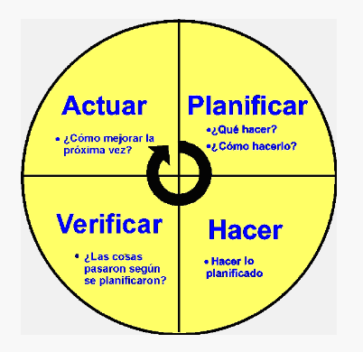
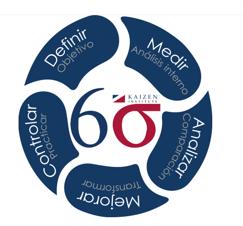
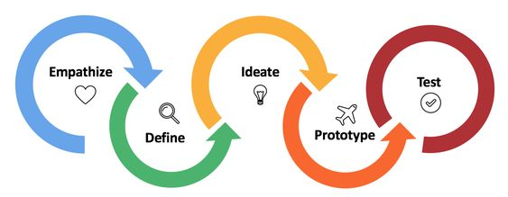
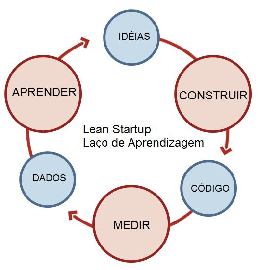
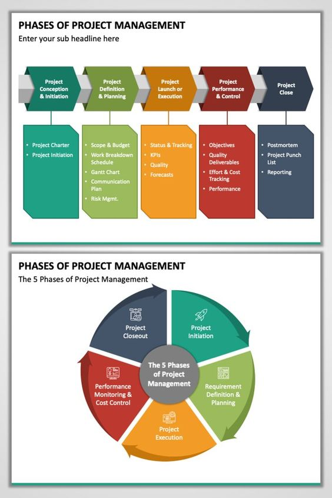

```{r setup, include=FALSE}
knitr::opts_chunk$set(echo = TRUE)
# Colores - paleta de azules
c1="#001A33"
c2="#003366"
c3="#004080"
c4="#1A8CFF"
c5="#4DA6FF"
c6="#80BFFF"
c7="#B3D9FF"

# <span style="color:#001A33"> 

## <span style="color:#003366">  

### <span style="color:#004080">
### <span style="color:#1A8CFF">
### <span style="color:#4DA6FF">
### <span style="color:#80BFFF">
### <span style="color:#B3D9FF">

```

<br/><br/>

Para el planteamiento de proyectos desde la detección de problemas, hay varias metodologías y enfoques que se pueden emplear. A continuación, se presentan  algunas de las metodologías más conocidas: 

<br/><br/>

## **Ciclo PHVA (Planificar, Hacer, Verificar, Actuar):** 

Como se mencionó anteriormente, el ciclo PHVA es un enfoque efectivo para abordar problemas y proyectos. Comienza identificando el problema en la etapa "Planificar", desarrollando un plan de acción, implementándolo en la etapa "Hacer", verificando los resultados y actuando en consecuencia para mejorar. Luego, se repite el ciclo para la mejora continua.


```{r, echo=FALSE, out.width="50%", fig.align = "center"}

```

<!-- |Ventajas                                 | Desventajas                         | -->
<!-- |:----------------------------------------|:------------------------------------| -->
<!-- |**Enfoque a mejora continua**: Promueve un enfoque constante en la mejora de procesos y productos. Al seguir este ciclo, las organizaciones pueden identificar áreas de mejora y realizar ajustes de manera periódica.| **Requiere tiempo y recursos**: La implementación de la metodología puede requerir tiempo y recursos considerables, especialmente en organizaciones que están empezando a aplicarla.| -->
<!-- |**Enfoque sistemático**: Es un proceso sistemático que se adapta bien a la gestión de la calidad. Ayuda a las organizaciones a abordar problemas de manera estructurada y a tomar decisiones basadas en datos.|**No es una solución rápida**: Es un enfoque a largo plazo que no proporciona soluciones rápidas. Puede llevar tiempo antes de ver resultados significativos.| -->
<!-- |**Orientación a la prevención**: Se centra en prevenir problemas en lugar de corregirlos después de que hayan ocurrido. Esto puede reducir los costos y aumentar la eficiencia.|**Resistencia al cambio**: Algunas personas pueden resistirse al cambio, y su implementación a menudo implica cambios en la cultura organizativa y en los procesos de trabajo existentes.| -->
<!-- |**Flexibilidad**: El ciclo se puede aplicar a una amplia variedad de procesos y sistemas, desde la producción y la fabricación hasta la gestión de proyectos y la prestación de servicios.|**Necesidad de formación**: Para implementarlo de manera efectiva, las organizaciones y los empleados deben adquirir habilidades en la recopilación y análisis de datos, así como en la toma de decisiones basadas en datos.| -->
<!-- |**Toma de decisiones informadas**: La fase de Verificar implica la recopilación y análisis de datos, lo que permite tomar decisiones informadas y basadas en evidencia.|**Complejidad**: Aunque es un enfoque valioso, puede resultar complejo, especialmente en organizaciones grandes o en proyectos grandes. La gestión y la documentación adecuadas son fundamentales.| -->


<br/><br/>

## **Six Sigma:** 

Six Sigma es un enfoque de mejora de procesos que se enfoca en reducir la variabilidad y mejorar la calidad. Se utiliza DMAIC (Definir, Medir, Analizar, Mejorar, Controlar) como una metodología estructurada para abordar problemas y proyectos. Comienza con la definición del problema, la medición de los datos, el análisis de las causas raíz, la implementación de mejoras y el control continuo del proceso. Fué  desarrollado por Bill Smith, en 1986.


```{r, echo=FALSE, out.width="50%", fig.align = "center"}

```

<!-- |Ventajas                                 | Desventajas                         | -->
<!-- |:----------------------------------------|:------------------------------------| -->
<!-- |**Mejora de la calidad**: Seis Sigma se centra en la reducción de defectos y la mejora de la calidad de los productos o servicios, lo que conduce a la satisfacción del cliente y a una mayor lealtad de los clientes.|**Requiere recursos y tiempo**: La implementación de Seis Sigma puede requerir una inversión significativa en formación, personal y herramientas, lo que puede ser costoso y llevar tiempo.| -->
<!-- |**Enfoque basado en datos**: La metodología Seis Sigma se basa en la recopilación y análisis de datos, lo que permite tomar decisiones informadas y objetivas.|**Enfoque en proyectos aislados**: En algunas organizaciones, Seis Sigma se utiliza en proyectos aislados en lugar de una estrategia integral, lo que limita su impacto general.| -->
<!-- |**Reducción de costos**: Al eliminar defectos y reducir la variabilidad en los procesos, Seis Sigma puede llevar a una reducción de costos significativa, ya que se evitan gastos relacionados con retrabajos, devoluciones y pérdida de clientes.|**Complejo**: La metodología Seis Sigma puede resultar compleja, especialmente para organizaciones pequeñas o en sectores no manufactureros. La comprensión y la aplicación de las herramientas pueden ser desafiantes.| -->
<!-- |**Aumento de la eficiencia**: La metodología Seis Sigma ayuda a identificar y eliminar actividades innecesarias o ineficientes en los procesos, lo que aumenta la eficiencia operativa.|**Enfoque enfocado en la mejora cuantitativa**: Seis Sigma se enfoca en la reducción de defectos cuantitativos, lo que puede no ser adecuado para todos los tipos de organizaciones o problemas que requieren enfoques cualitativos.| -->
<!-- |**Enfoque estructurado**: Seis Sigma proporciona un marco de trabajo estructurado con herramientas y técnicas definidas para abordar problemas, lo que facilita la gestión de proyectos y la toma de decisiones.|**Resistencia al cambio**: Algunos empleados y líderes pueden resistirse al cambio que implica Seis Sigma, ya que puede alterar la forma en que se realizan las tareas cotidianas.| -->
<!-- |**Enfoque en el cliente**: Seis Sigma tiene un fuerte enfoque en la satisfacción del cliente, lo que ayuda a alinear los objetivos de la organización con las necesidades y expectativas de los clientes.|| -->

<br/><br/>

## **Design Thinking:** 

**Design Thinking** es una metodología centrada en el usuario que se utiliza para abordar problemas complejos y fomentar la innovación. Se inicia con la empatía hacia los usuarios, la definición del problema, la generación de ideas, la creación de prototipos y pruebas, y la implementación de soluciones.

Esta métodolgía puede ayudar en generación de proyectos de innovación, en la mejora de experiencia del cliente y desarrollo de nuevos productos o servicios, Design Thinking puede ser una excelente elección para entender las necesidades y deseos de los clientes y a diseñar soluciones centradas en el usuario.

Fue  creado por Herbert Simon en 1969, popularizado por David Kelley en la década de los noventa.


```{r, echo=FALSE, out.width="50%", fig.align = "center"}

```


<!-- |Ventajas                                 | Desventajas                         | -->
<!-- |:----------------------------------------|:------------------------------------| -->
<!-- |**Enfoque centrado en el usuario**: El Design Thinking se centra en comprender profundamente las necesidades, deseos y perspectivas de los usuarios, lo que puede llevar a soluciones más efectivas y satisfactorias.|**Tiempo y recursos**: El proceso de Design Thinking puede ser intensivo en tiempo y recursos, especialmente cuando se realiza de manera exhaustiva. Puede requerir la inversión de tiempo significativo en investigación y prototipado.| -->
<!-- |**Creatividad e innovación**: El Design Thinking fomenta la creatividad y la generación de ideas innovadoras al fomentar la colaboración interdisciplinaria y la exploración de múltiples soluciones.|**Falta de estructura**: A diferencia de otros enfoques más estructurados, como Seis Sigma, el Design Thinking puede parecer menos prescriptivo y puede resultar confuso para algunas personas que prefieren una guía más rígida.| -->
<!-- |**Flexibilidad**: Es un enfoque flexible y adaptable que se puede aplicar a una amplia variedad de problemas y contextos, desde el diseño de productos hasta la mejora de procesos y servicios.|**Riesgo de sobrevaloración de la creatividad**: En ocasiones, el Design Thinking puede dar lugar a soluciones creativas pero impracticables o poco realistas si no se equilibra adecuadamente con la viabilidad técnica y económica.| -->
<!-- |**Enfoque iterativo**: Design Thinking utiliza un proceso iterativo que permite probar y refinar soluciones a medida que se desarrollan, lo que reduce el riesgo de fracaso y mejora la calidad de las soluciones.|**Resistencia al cambio**: En algunas organizaciones, puede haber resistencia al cambio hacia un enfoque más centrado en el usuario y creativo, especialmente en entornos más tradicionales.| -->
<!-- |**Empatía y comprensión**: El Design Thinking fomenta una profunda empatía con los usuarios y una comprensión de sus necesidades reales, lo que ayuda a evitar soluciones basadas en suposiciones.|**Resultados no garantizados**: El Design Thinking no garantiza el éxito en todos los casos. Aunque es una herramienta valiosa para la innovación, no siempre conduce a soluciones efectivas o rentables.| -->


<br/><br/>

##  **Lean Startup:** 

El enfoque **Lean Startup** se centra en la creación rápida de prototipos y pruebas de hipótesis para desarrollar un proyecto o producto. Esta metodología fué creado por Eric Ries en 2011. Se inicia con la identificación de un problema, la creación de un producto mínimo viable (MVP), la medición de resultados y el aprendizaje continuo. Este enfoque es especialmente adecuado para proyectos empresariales y startups.

En caso que la entidad tenga como propósito el desarrollar nuevos productos financieros o servicios, **Lean Startup** es una metodología efectiva. Ayuda a validar rápidamente las ideas y a crear MVPs (Mínimos Productos Viables) para probar en el mercado antes de invertir en el desarrollo completo. 


```{r, echo=FALSE, out.width="50%", fig.align = "center"}

```

<!-- |Ventajas                                 | Desventajas                         | -->
<!-- |:----------------------------------------|:------------------------------------| -->
<!-- |**Minimización de riesgos financieros**: Lean Startup aboga por la creación de un "mínimo producto viable" (MVP) para probar ideas en el mercado antes de invertir grandes cantidades de tiempo y dinero en el desarrollo completo de un producto. Esto ayuda a minimizar los riesgos financieros.|**Requiere habilidades y recursos**: La implementación exitosa de Lean Startup requiere habilidades en recopilación y análisis de datos, así como recursos para llevar a cabo experimentos y crear MVPs.| -->
<!-- |**Aprendizaje continuo**: La metodología fomenta la experimentación constante y la recopilación de datos reales del mercado, lo que permite a las empresas aprender rápidamente y ajustar su enfoque según los resultados.|**Enfoque limitado**: Lean Startup es especialmente efectivo en entornos donde el producto o servicio se puede probar fácilmente, pero puede no ser adecuado para proyectos altamente tecnológicos o de largo plazo.| -->
<!-- |**Enfoque en el cliente**: Lean Startup pone un énfasis significativo en entender las necesidades del cliente y en la creación de productos o servicios que resuelvan problemas reales. Esto puede mejorar la satisfacción del cliente y la retención.|Exceso de confianza en los datos: En ocasiones, las empresas pueden confiar en exceso en los datos recopilados sin considerar otros factores importantes, como el mercado, la competencia y la viabilidad técnica.| -->
<!-- |**Flexibilidad y adaptabilidad**: La metodología permite a las empresas pivotar (realizar cambios fundamentales en su enfoque) si los datos indican que su idea inicial no es viable. Esto evita la continuación de un enfoque fallido.|**Presión para resultados a corto plazo**: La metodología puede poner una presión indebida en la obtención de resultados a corto plazo, lo que puede llevar a decisiones apresuradas o a la omisión de consideraciones a largo plazo.| -->
<!-- |**Eficiencia en el desarrollo**: Al evitar el desarrollo completo de un producto antes de obtener retroalimentación del mercado, Lean Startup puede llevar a un uso más eficiente de los recursos y reducir el tiempo necesario para llevar un producto al mercado.|**Necesidad de un cambio cultural**: La implementación exitosa de Lean Startup puede requerir un cambio cultural en una organización para abrazar la experimentación y la adaptabilidad, lo cual puede ser un desafío en entornos más tradicionales.| -->

<br/><br/>

## **Project Management Institute (PMI):** 

El **PMI** proporciona un marco de trabajo completo para la gestión de proyectos, que incluye la identificación del problema (iniciación del proyecto), la planificación, la ejecución, el monitoreo y control, y el cierre del proyecto. Este enfoque es ampliamente utilizado en la gestión de proyectos en diversas industrias.


```{r, echo=FALSE, out.width="50%", fig.align = "center"}
# 
```

<!-- |Ventajas                                 | Desventajas                         | -->
<!-- |:----------------------------------------|:------------------------------------| -->
<!-- |**Estándares reconocidos internacionalmente**: Las prácticas y estándares de PMI son ampliamente reconocidos y aceptados a nivel global. Esto facilita la comunicación y la colaboración en proyectos internacionales.|**Rigidez en la aplicación**: El enfoque de PMI puede parecer rígido y burocrático en proyectos más pequeños o ágiles, lo que puede resultar en un exceso de documentación y procesos innecesarios.| -->
<!-- |**Enfoque estructurado**: PMI proporciona un enfoque estructurado y detallado para la gestión de proyectos, lo que puede ser especialmente útil en proyectos complejos y de gran envergadura.|Costos asociados: Obtener certificaciones de PMI y utilizar el marco PMBOK puede ser costoso, tanto en términos de tiempo como de dinero.| -->
<!-- |**Mejora la eficiencia y eficacia**: El uso de las mejores prácticas de PMI puede ayudar a mejorar la eficiencia y la eficacia en la gestión de proyectos al proporcionar una guía detallada para la planificación, ejecución y control de proyectos.|**Complejidad**: Para proyectos pequeños y sencillos, la aplicación de todas las prácticas y procesos de PMI puede ser innecesariamente compleja y sobrecargar al equipo de proyecto.| -->
<!-- |**Profesionalización**: PMI ofrece certificaciones profesionales, como la certificación PMP (Project Management Professional), que ayudan a los profesionales de la gestión de proyectos a demostrar su experiencia y conocimientos.|**Falta de adaptabilidad**: PMI puede no ser adecuado para todos los tipos de proyectos, especialmente aquellos que requieren un enfoque más ágil y adaptativo.| -->
<!-- |**Red de profesionales**: PMI cuenta con una amplia red de miembros y profesionales de la gestión de proyectos que pueden brindar apoyo, compartir experiencias y mejores prácticas.|**Énfasis en la documentación**: El enfoque de PMI a menudo pone un énfasis significativo en la documentación, lo que puede aumentar la carga administrativa en la gestión de proyectos.| -->

<br/><br/>

## **Metodología Canvas:** 

El **Modelo Canvas**, tambien llamada "Business Model Canvas" es una herramienta que permite definir, visualizar y comunicar aspectos clave de un proyecto o negocio. Ayuda a identificar problemas y oportunidades al enfocarse en segmentos de clientes, propuesta de valor, canales, relaciones con clientes, fuentes de ingresos, recursos clave, actividades clave, socios clave y estructura de costos.

El enfoque que elijas dependerá de la naturaleza del problema, el tipo de proyecto y tus objetivos específicos. Es importante seleccionar la metodología que mejor se adapte a tu situación y asegurarte de seguir un proceso estructurado para abordar los problemas y proyectos de manera efectiva.

Pueden ayudar a identificar las fuentes de ingresos, los segmentos de clientes y las actividades clave necesarias para que un proyecto sea exitoso.

<!-- |Ventajas                                 | Desventajas                         | -->
<!-- |:----------------------------------------|:------------------------------------| -->
<!-- |**Visión holística**: El Business Model Canvas proporciona una vista holística y visual de un modelo de negocio en una sola página, lo que facilita la comunicación y la comprensión de todas las partes interesadas.|**Superficialidad**: Aunque proporciona una visión general, el Business Model Canvas a menudo no profundiza lo suficiente en detalles específicos que pueden ser críticos para el éxito de un negocio.| -->
<!-- |**Flexibilidad**: Es flexible y se puede utilizar en una amplia variedad de industrias y contextos para diseñar o revisar modelos de negocios.|**Limitaciones en la validación**: No proporciona un enfoque sistemático para validar la viabilidad de un modelo de negocio, lo que significa que se requiere una investigación adicional.| -->
<!-- |**Enfoque en el valor**: Permite a las empresas centrarse en la propuesta de valor para el cliente y cómo se generará ingresos. -->
<!-- |**Colaborativo**: Es una herramienta efectiva para la colaboración en equipo y puede ayudar a alinear a los miembros del equipo en torno a un enfoque común.|| -->

<br/><br/><br/>


# **Evaluación**

Empareje las siguientes situaciones con la respectiva metodologia:

|                                       |                                         |
|:--------------------------------------|:----------------------------------------|
|6. Un banco ha detectado un aumento en la tasa de morosidad de los créditos hipotecarios en Colombia durante el último trimestre. El banco quiere reducir la morosidad y mejorar la calidad de su cartera de créditos. --> | a. Ciclo PHVA : El banco puede utilizar el ciclo PHVA para analizar las causas del aumento de la morosidad, implementar medidas para reducirla y evaluar la efectividad de estas medidas.| 
|                                        |                                   |
|5. Una empresa de seguros quiere reducir el tiempo que tarda en procesar las reclamaciones de sus clientes. La empresa quiere mejorar la eficiencia de sus operaciones y aumentar la satisfacción de sus clientes. --> |b. Six Sigma: La empresa puede utilizar Six Sigma para identificar los puntos críticos del proceso de procesamiento de reclamaciones, eliminar las actividades innecesarias y reducir la variabilidad del proceso.|
|                                        |                                    |
|4.  Una entidad financiera quiere desarrollar un nuevo producto financiero que satisfaga las necesidades de sus clientes millennials. La entidad quiere entender mejor las necesidades de este segmento de mercado y desarrollar un producto innovador que sea atractivo para ellos. -->  |c. Design Thinking: La entidad financiera puede utilizar Design Thinking para realizar una investigación profunda de las necesidades de los millennials, generar ideas creativas para nuevos productos financieros y desarrollar prototipos de productos para probar con este segmento de mercado.|
|                                        |                                   |
|3. Una empresa de tecnología financiera quiere lanzar una nueva plataforma de pagos online. La empresa quiere minimizar el riesgo y desarrollar una plataforma que satisfaga las necesidades de sus clientes. -->  |d. Lean Startup: La empresa puede utilizar Lean Startup para crear un producto mínimo viable (MVP) de la plataforma de pagos, lanzarlo al mercado y obtener feedback de los clientes. La empresa puede utilizar este feedback para mejorar la plataforma y aumentar sus posibilidades de éxito.|
|                                       |                                 | 
|1. Un banco está implementando un nuevo sistema de core bancario. El banco quiere asegurar que el proyecto se complete a tiempo, dentro del presupuesto y con la calidad requerida. -->  |e. Project Management Institute: El banco puede utilizar las mejores prácticas del Project Management Institute para gestionar el proyecto de implementación del nuevo sistema core bancario.|
|                                       |                                  |
|2. Una empresa quiere desarrollar un nuevo modelo de negocio para financiar proyectos de emprendimiento. La empresa quiere identificar las oportunidades de mercado y desarrollar un modelo de negocio sostenible. --> |f. Metodología Canvas: La empresa puede utilizar la metodología Canvas para definir la propuesta de valor, el mercado objetivo, los canales de distribución, la estrategia de marketing y la estructura de costes del nuevo modelo de negocio.|
|                                        |                                 |


a. Ciclo PHVA
b. Six Sigma
c. Design Thinking
d. Lean Startup
e. Project Management Institute
f. Metodología Canvas
