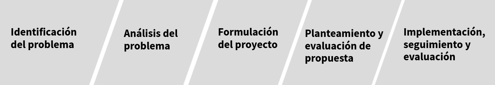

```{r setup, include=FALSE}
knitr::opts_chunk$set(echo = TRUE)
# Colores - paleta de azules
c1="#001A33"
c2="#003366"
c3="#004080"
c4="#1A8CFF"
c5="#4DA6FF"
c6="#80BFFF"
c7="#B3D9FF"

# <span style="color:#001A33"> 

## <span style="color:#003366">  

### <span style="color:#004080">
### <span style="color:#1A8CFF">
### <span style="color:#4DA6FF">
### <span style="color:#80BFFF">
### <span style="color:#B3D9FF">

```

<br/><br/>

La detección efectiva de **problemas** y la formulación de **proyectos**  son habilidades cruciales para el éxito de cualquier institución. Estas capacidades permiten identificar áreas de mejora, optimizar recursos y alcanzar objetivos estratégicos. Para detectar problemas y plantear proyectos en una institución se pueden seguir los siguientes pasos:

<br/><br/>

```{r, echo=FALSE, out.width="100%", fig.align = "center"}

```

<br/><br/>

**1. Identificación de problemas**:

* Prestar atención a las actividades diarias, flujos de trabajo, comunicaciones, y retroalimentación de usuarios o clientes.

* Buscar ineficiencias, cuellos de botella, inconsistencias, duplicaciones de tareas, o cualquier situación que obstaculice el buen funcionamiento de la institución.

* Revisar métricas de desempeño, encuestas, informes, estadísticas, y registros históricos para identificar tendencias, patrones o desviaciones que indiquen la existencia de problemas.

* Fomentar una cultura de comunicación abierta donde los empleados, clientes y otros interesados puedan expresar sus inquietudes, sugerencias y observaciones sobre problemas potenciales.

<br/><br/>

**2. Análisis de problemas**:

* Una vez identificado un problema, definirlo de manera clara, concisa y específica. Esto implica describir la situación actual, los impactos negativos que genera, y las áreas o procesos afectados.

* Investigar las causas profundas del problema, no solo los síntomas. Utilizar técnicas como el análisis de causa raíz o los diagramas de Ishikawa para identificar los factores subyacentes que contribuyen al problema.

* Evaluar las consecuencias del problema en términos de impacto financiero, pérdida de productividad, deterioro de la calidad, riesgos potenciales, o afectación a la imagen de la institución.

<br/><br/>

**3. Formulación de proyectos**:

* Definir objetivos específicos, medibles, alcanzables, relevantes y con un plazo determinado (SMART) para abordar el problema identificado. Estos objetivos deben estar alineados con la misión y visión de la institución.

* Establecer claramente el alcance del proyecto, delimitando las actividades, tareas y entregables que se incluirán. También es importante definir las limitaciones del proyecto, considerando los recursos disponibles, el tiempo y las restricciones presupuestarias.

* Seleccionar una metodología adecuada para la gestión del proyecto, como Agile o Waterfall, y desarrollar un cronograma realista que detalle las etapas del proyecto, las tareas asignadas, y los plazos de entrega.

* Identificar los recursos humanos, materiales, financieros y tecnológicos necesarios para llevar a cabo el proyecto de manera efectiva.


<br/><br/>

**4. Planteamiento y evaluación de propuestas**:

* Elaborar una propuesta de proyecto que describa de manera clara y concisa los objetivos, alcances, metodología, cronograma, recursos necesarios, presupuesto estimado, y los beneficios esperados para la institución.

* Evaluar cuidadosamente las propuestas de proyectos considerando su viabilidad, impacto potencial, alineación con la estrategia institucional, y la capacidad para resolver el problema identificado.

* Obtener la aprobación formal de las autoridades competentes y asegurar la financiación necesaria para la ejecución del proyecto seleccionado.

<br/><br/>

**5. Implementación, seguimiento y evaluación**:

* Implementar el proyecto de acuerdo al plan establecido, monitoreando el progreso, controlando los recursos y gestionando los riesgos potenciales.

* Mantener una comunicación abierta y fluida con las partes interesadas, proporcionando actualizaciones periódicas sobre el avance del proyecto y cualquier cambio o ajuste que se requiera.

* Al finalizar el proyecto, realizar una evaluación exhaustiva para determinar su éxito en el logro de los objetivos, medir el impacto generado y documentar las lecciones aprendidas para futuros proyectos.


<br/><br/><br/><br/>

### **Evaluacion**

Para cada una de las siguientes situaciones determina  el paso al que corresponde entre los siguientes: 

1. Identificación de problemas
2. Análisis de problemas
3. Formulación de proyectos
4. Planteamiento y evaluación de propuestas
5. Implementación, seguimiento y evaluación

<br/><br/>

<div class="content-box-blue">
#### **Situación 1** :

Una entidad financiera ha recibido reclamos de clientes sobre la lentitud en la aprobación de préstamos. Para ello analiza los flujos de trabajo y procesos de aprobación de préstamos, identifica posibles cuellos de botella y busca formas de agilizar el proceso sin comprometer la calidad de la evaluación crediticia.
</div>

### Etapa:  
Identificación de problemas

<br/><br/>

<div class="content-box-blue">
#### **Situación 2** :
Un banco ha notado un aumento en los errores en los estados de cuenta de los clientes, y revisa los procesos de generación de estados de cuenta, identifica las causas de los errores y desarrolla un plan para mejorar la precisión en la emisión de estados de cuenta.
</div>

### Etapa: 
Identificación de problemas


<br/><br/>

<div class="content-box-blue">
#### **Situación 3** :
Una entidad financiera ha observado una disminución en la satisfacción del cliente. Con este propósito investiga las causas subyacentes de la insatisfacción del cliente, como la calidad del servicio al cliente o la falta de opciones de productos financieros, y propone mejoras para aumentar la satisfacción del cliente.
</div>

### Etapa: 
Análisis de problemas


<br/><br/>

<div class="content-box-blue">
#### **Situación 4** :
Una cooperativa de crédito ha detectado un aumento en los préstamos incobrables para lo cual analiza las causas de los préstamos incobrables, como la falta de evaluación de riesgos o la mala gestión de la cartera de préstamos, y desarrollar estrategias para reducir los préstamos incobrables en el futuro.
</div>

### Etapa: 
Análisis de problemas


<div class="content-box-blue">
#### **Situación 5** :
Un banco desea mejorar la seguridad de sus transacciones en línea para lo cual define objetivos SMART para implementar medidas de seguridad adicionales, como la autenticación de dos factores, para proteger las transacciones en línea de los clientes.

</div>

### Etapa: 
Formulación de proyectos


<br/><br/>

<div class="content-box-blue">
#### **Situación 6** :
Una empresa de seguros quiere aumentar la eficiencia en el procesamiento de reclamos. Con este propósito define un proyecto que incluya la implementación de un sistema de procesamiento de reclamos automatizado y la capacitación del personal en el nuevo sistema, con el objetivo de reducir los tiempos de procesamiento de reclamos.

</div>

### Etapa: 
Formulación de proyectos 


<br/><br/>


<div class="content-box-blue">
#### **Situación 7** :
Una entidad financiera está considerando expandirse a nuevos mercados y  elabora una propuesta que describa los mercados objetivo, la estrategia de expansión, los recursos necesarios y los beneficios esperados, y evaluar su viabilidad y impacto potencial en el crecimiento de la entidad financiera.
</div>

### Etapa: 
Planteamiento y evaluación de propuestas


<br/><br/>

<div class="content-box-blue">
#### **Situación 8** :
Un banco está evaluando la posibilidad de ofrecer nuevos productos financieros, para ello elabora una propuesta que describa los nuevos productos financieros, su mercado objetivo, la estrategia de lanzamiento y el presupuesto estimado, y evaluar su viabilidad y potencial para aumentar los ingresos del banco.
</div>

### Etapa: 
Planteamiento y evaluación de propuestas


<br/><br/>

<div class="content-box-blue">
#### **Situación 9** :
Una institución financiera ha implementado un nuevo sistema de gestión de riesgos, con este propósito implementa el nuevo sistema de gestión de riesgos según el plan establecido, monitorear su efectividad en la identificación y mitigación de riesgos, y realiza ajustes según sea necesario para mejorar su desempeño.
</div>

### Etapa
Implementación, seguimiento y evaluación:


<br/><br/>


<div class="content-box-blue">
#### **Situación 10** : 
Un banco ha lanzado un programa de educación financiera para sus clientes, para lo cuál implementa el programa de educación financiera, monitorear su impacto en la educación financiera de los clientes y evalua su éxito en el logro de los objetivos de educación financiera establecidos.
</div>

### Etapa: 
Implementación, seguimiento y evaluación

<br/><br/>

