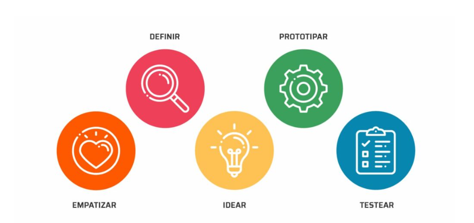

```{r setup, include=FALSE}
knitr::opts_chunk$set(echo = TRUE)
# Colores - paleta de azules
c1="#001A33"
c2="#003366"
c3="#004080"
c4="#1A8CFF"
c5="#4DA6FF"
c6="#80BFFF"
c7="#B3D9FF"

# <span style="color:#001A33"> 

## <span style="color:#003366">  

### <span style="color:#004080">
### <span style="color:#1A8CFF">
### <span style="color:#4DA6FF">
### <span style="color:#80BFFF">
### <span style="color:#B3D9FF">

```

<br/><br/>

Para el planteamiento de proyectos desde la detección de problemas, hay varias metodologías y enfoques que se pueden emplear. A continuación, se presentan  algunas de las metodologías más conocidas: 

<br/><br/>

## **Ciclo PHVA (Planificar, Hacer, Verificar, Actuar):** 

Como se mencionó anteriormente, el ciclo PHVA es un enfoque efectivo para abordar problemas y proyectos. Comienza identificando el problema en la etapa "Planificar", desarrollando un plan de acción, implementándolo en la etapa "Hacer", verificando los resultados y actuando en consecuencia para mejorar. Luego, se repite el ciclo para la mejora continua.


```{r, echo=FALSE, out.width="50%", fig.align = "center"}
knitr::include_graphics("img/ciclo_PHVA.png")
```

|Ventajas                                 | Desventajas                         |
|:----------------------------------------|:------------------------------------|
|**Enfoque a mejora continua**: Promueve un enfoque constante en la mejora de procesos y productos. Al seguir este ciclo, las organizaciones pueden identificar áreas de mejora y realizar ajustes de manera periódica.| **Requiere tiempo y recursos**: La implementación de la metodología puede requerir tiempo y recursos considerables, especialmente en organizaciones que están empezando a aplicarla.|
|**Enfoque sistemático**: Es un proceso sistemático que se adapta bien a la gestión de la calidad. Ayuda a las organizaciones a abordar problemas de manera estructurada y a tomar decisiones basadas en datos.|**No es una solución rápida**: Es un enfoque a largo plazo que no proporciona soluciones rápidas. Puede llevar tiempo antes de ver resultados significativos.|
|**Orientación a la prevención**: Se centra en prevenir problemas en lugar de corregirlos después de que hayan ocurrido. Esto puede reducir los costos y aumentar la eficiencia.|**Resistencia al cambio**: Algunas personas pueden resistirse al cambio, y su implementación a menudo implica cambios en la cultura organizativa y en los procesos de trabajo existentes.|
|**Flexibilidad**: El ciclo se puede aplicar a una amplia variedad de procesos y sistemas, desde la producción y la fabricación hasta la gestión de proyectos y la prestación de servicios.|**Necesidad de formación**: Para implementarlo de manera efectiva, las organizaciones y los empleados deben adquirir habilidades en la recopilación y análisis de datos, así como en la toma de decisiones basadas en datos.|
|**Toma de decisiones informadas**: La fase de Verificar implica la recopilación y análisis de datos, lo que permite tomar decisiones informadas y basadas en evidencia.|**Complejidad**: Aunque es un enfoque valioso, puede resultar complejo, especialmente en organizaciones grandes o en proyectos grandes. La gestión y la documentación adecuadas son fundamentales.|


<br/><br/>

## **Six Sigma:** 

Six Sigma es un enfoque de mejora de procesos que se enfoca en reducir la variabilidad y mejorar la calidad. Se utiliza DMAIC (Definir, Medir, Analizar, Mejorar, Controlar) como una metodología estructurada para abordar problemas y proyectos. Comienza con la definición del problema, la medición de los datos, el análisis de las causas raíz, la implementación de mejoras y el control continuo del proceso. Fué  desarrollado por Bill Smith, en 1986.


```{r, echo=FALSE, out.width="50%", fig.align = "center"}
knitr::include_graphics("img/sixsigma.png")
```

|Ventajas                                 | Desventajas                         |
|:----------------------------------------|:------------------------------------|
|**Mejora de la calidad**: Seis Sigma se centra en la reducción de defectos y la mejora de la calidad de los productos o servicios, lo que conduce a la satisfacción del cliente y a una mayor lealtad de los clientes.|**Requiere recursos y tiempo**: La implementación de Seis Sigma puede requerir una inversión significativa en formación, personal y herramientas, lo que puede ser costoso y llevar tiempo.|
|**Enfoque basado en datos**: La metodología Seis Sigma se basa en la recopilación y análisis de datos, lo que permite tomar decisiones informadas y objetivas.|**Enfoque en proyectos aislados**: En algunas organizaciones, Seis Sigma se utiliza en proyectos aislados en lugar de una estrategia integral, lo que limita su impacto general.|
|**Reducción de costos**: Al eliminar defectos y reducir la variabilidad en los procesos, Seis Sigma puede llevar a una reducción de costos significativa, ya que se evitan gastos relacionados con retrabajos, devoluciones y pérdida de clientes.|**Complejo**: La metodología Seis Sigma puede resultar compleja, especialmente para organizaciones pequeñas o en sectores no manufactureros. La comprensión y la aplicación de las herramientas pueden ser desafiantes.|
|**Aumento de la eficiencia**: La metodología Seis Sigma ayuda a identificar y eliminar actividades innecesarias o ineficientes en los procesos, lo que aumenta la eficiencia operativa.|**Enfoque enfocado en la mejora cuantitativa**: Seis Sigma se enfoca en la reducción de defectos cuantitativos, lo que puede no ser adecuado para todos los tipos de organizaciones o problemas que requieren enfoques cualitativos.|
|**Enfoque estructurado**: Seis Sigma proporciona un marco de trabajo estructurado con herramientas y técnicas definidas para abordar problemas, lo que facilita la gestión de proyectos y la toma de decisiones.|**Resistencia al cambio**: Algunos empleados y líderes pueden resistirse al cambio que implica Seis Sigma, ya que puede alterar la forma en que se realizan las tareas cotidianas.|
|**Enfoque en el cliente**: Seis Sigma tiene un fuerte enfoque en la satisfacción del cliente, lo que ayuda a alinear los objetivos de la organización con las necesidades y expectativas de los clientes.||

<br/><br/>

## **Design Thinking:** 

**Design Thinking** es una metodología centrada en el usuario que se utiliza para abordar problemas complejos y fomentar la innovación. Se inicia con la empatía hacia los usuarios, la definición del problema, la generación de ideas, la creación de prototipos y pruebas, y la implementación de soluciones.

Esta métodolgía puede ayudar en generación de proyectos de innovación, en la mejora de experiencia del cliente y desarrollo de nuevos productos o servicios, Design Thinking puede ser una excelente elección para entender las necesidades y deseos de los clientes y a diseñar soluciones centradas en el usuario.

Fue  creado por Herbert Simon en 1969, popularizado por David Kelley en la década de los noventa.


```{r, echo=FALSE, out.width="50%", fig.align = "center"}

```


|Ventajas                                 | Desventajas                         |
|:----------------------------------------|:------------------------------------|
|**Enfoque centrado en el usuario**: El Design Thinking se centra en comprender profundamente las necesidades, deseos y perspectivas de los usuarios, lo que puede llevar a soluciones más efectivas y satisfactorias.|**Tiempo y recursos**: El proceso de Design Thinking puede ser intensivo en tiempo y recursos, especialmente cuando se realiza de manera exhaustiva. Puede requerir la inversión de tiempo significativo en investigación y prototipado.|
|**Creatividad e innovación**: El Design Thinking fomenta la creatividad y la generación de ideas innovadoras al fomentar la colaboración interdisciplinaria y la exploración de múltiples soluciones.|**Falta de estructura**: A diferencia de otros enfoques más estructurados, como Seis Sigma, el Design Thinking puede parecer menos prescriptivo y puede resultar confuso para algunas personas que prefieren una guía más rígida.|
|**Flexibilidad**: Es un enfoque flexible y adaptable que se puede aplicar a una amplia variedad de problemas y contextos, desde el diseño de productos hasta la mejora de procesos y servicios.|**Riesgo de sobrevaloración de la creatividad**: En ocasiones, el Design Thinking puede dar lugar a soluciones creativas pero impracticables o poco realistas si no se equilibra adecuadamente con la viabilidad técnica y económica.|
|**Enfoque iterativo**: Design Thinking utiliza un proceso iterativo que permite probar y refinar soluciones a medida que se desarrollan, lo que reduce el riesgo de fracaso y mejora la calidad de las soluciones.|**Resistencia al cambio**: En algunas organizaciones, puede haber resistencia al cambio hacia un enfoque más centrado en el usuario y creativo, especialmente en entornos más tradicionales.|
|**Empatía y comprensión**: El Design Thinking fomenta una profunda empatía con los usuarios y una comprensión de sus necesidades reales, lo que ayuda a evitar soluciones basadas en suposiciones.|**Resultados no garantizados**: El Design Thinking no garantiza el éxito en todos los casos. Aunque es una herramienta valiosa para la innovación, no siempre conduce a soluciones efectivas o rentables.|


<br/><br/>

##  **Lean Startup:** 

El enfoque **Lean Startup** se centra en la creación rápida de prototipos y pruebas de hipótesis para desarrollar un proyecto o producto. Esta metodología fué creado por Eric Ries en 2011. Se inicia con la identificación de un problema, la creación de un producto mínimo viable (MVP), la medición de resultados y el aprendizaje continuo. Este enfoque es especialmente adecuado para proyectos empresariales y startups.

En caso que la entidad tenga como propósito el desarrollar nuevos productos financieros o servicios, Lean Startup es una metodología efectiva. Ayuda a validar rápidamente las ideas y a crear MVPs (Mínimos Productos Viables) para probar en el mercado antes de invertir en el desarrollo completo. 


```{r, echo=FALSE, out.width="50%", fig.align = "center"}
knitr::include_graphics("img/lean.png")
```

|Ventajas                                 | Desventajas                         |
|:----------------------------------------|:------------------------------------|
|**Minimización de riesgos financieros**: Lean Startup aboga por la creación de un "mínimo producto viable" (MVP) para probar ideas en el mercado antes de invertir grandes cantidades de tiempo y dinero en el desarrollo completo de un producto. Esto ayuda a minimizar los riesgos financieros.|**Requiere habilidades y recursos**: La implementación exitosa de Lean Startup requiere habilidades en recopilación y análisis de datos, así como recursos para llevar a cabo experimentos y crear MVPs.|
|**Aprendizaje continuo**: La metodología fomenta la experimentación constante y la recopilación de datos reales del mercado, lo que permite a las empresas aprender rápidamente y ajustar su enfoque según los resultados.|**Enfoque limitado**: Lean Startup es especialmente efectivo en entornos donde el producto o servicio se puede probar fácilmente, pero puede no ser adecuado para proyectos altamente tecnológicos o de largo plazo.|
|**Enfoque en el cliente**: Lean Startup pone un énfasis significativo en entender las necesidades del cliente y en la creación de productos o servicios que resuelvan problemas reales. Esto puede mejorar la satisfacción del cliente y la retención.|Exceso de confianza en los datos: En ocasiones, las empresas pueden confiar en exceso en los datos recopilados sin considerar otros factores importantes, como el mercado, la competencia y la viabilidad técnica.|
|**Flexibilidad y adaptabilidad**: La metodología permite a las empresas pivotar (realizar cambios fundamentales en su enfoque) si los datos indican que su idea inicial no es viable. Esto evita la continuación de un enfoque fallido.|**Presión para resultados a corto plazo**: La metodología puede poner una presión indebida en la obtención de resultados a corto plazo, lo que puede llevar a decisiones apresuradas o a la omisión de consideraciones a largo plazo.|
|**Eficiencia en el desarrollo**: Al evitar el desarrollo completo de un producto antes de obtener retroalimentación del mercado, Lean Startup puede llevar a un uso más eficiente de los recursos y reducir el tiempo necesario para llevar un producto al mercado.|**Necesidad de un cambio cultural**: La implementación exitosa de Lean Startup puede requerir un cambio cultural en una organización para abrazar la experimentación y la adaptabilidad, lo cual puede ser un desafío en entornos más tradicionales.|

<br/><br/>

## **Project Management Institute (PMI):** 

El **PMI** proporciona un marco de trabajo completo para la gestión de proyectos, que incluye la identificación del problema (iniciación del proyecto), la planificación, la ejecución, el monitoreo y control, y el cierre del proyecto. Este enfoque es ampliamente utilizado en la gestión de proyectos en diversas industrias.


```{r, echo=FALSE, out.width="50%", fig.align = "center"}

```

|Ventajas                                 | Desventajas                         |
|:----------------------------------------|:------------------------------------|
|**Estándares reconocidos internacionalmente**: Las prácticas y estándares de PMI son ampliamente reconocidos y aceptados a nivel global. Esto facilita la comunicación y la colaboración en proyectos internacionales.|**Rigidez en la aplicación**: El enfoque de PMI puede parecer rígido y burocrático en proyectos más pequeños o ágiles, lo que puede resultar en un exceso de documentación y procesos innecesarios.|
|**Enfoque estructurado**: PMI proporciona un enfoque estructurado y detallado para la gestión de proyectos, lo que puede ser especialmente útil en proyectos complejos y de gran envergadura.|Costos asociados: Obtener certificaciones de PMI y utilizar el marco PMBOK puede ser costoso, tanto en términos de tiempo como de dinero.|
|**Mejora la eficiencia y eficacia**: El uso de las mejores prácticas de PMI puede ayudar a mejorar la eficiencia y la eficacia en la gestión de proyectos al proporcionar una guía detallada para la planificación, ejecución y control de proyectos.|**Complejidad**: Para proyectos pequeños y sencillos, la aplicación de todas las prácticas y procesos de PMI puede ser innecesariamente compleja y sobrecargar al equipo de proyecto.|
|**Profesionalización**: PMI ofrece certificaciones profesionales, como la certificación PMP (Project Management Professional), que ayudan a los profesionales de la gestión de proyectos a demostrar su experiencia y conocimientos.|**Falta de adaptabilidad**: PMI puede no ser adecuado para todos los tipos de proyectos, especialmente aquellos que requieren un enfoque más ágil y adaptativo.|
|**Red de profesionales**: PMI cuenta con una amplia red de miembros y profesionales de la gestión de proyectos que pueden brindar apoyo, compartir experiencias y mejores prácticas.|**Énfasis en la documentación**: El enfoque de PMI a menudo pone un énfasis significativo en la documentación, lo que puede aumentar la carga administrativa en la gestión de proyectos.|

<br/><br/>

## **Metodología Canvas:** 

El **Modelo Canvas**, tambien llamada "Business Model Canvas" es una herramienta que permite definir, visualizar y comunicar aspectos clave de un proyecto o negocio. Ayuda a identificar problemas y oportunidades al enfocarse en segmentos de clientes, propuesta de valor, canales, relaciones con clientes, fuentes de ingresos, recursos clave, actividades clave, socios clave y estructura de costos.

El enfoque que elijas dependerá de la naturaleza del problema, el tipo de proyecto y tus objetivos específicos. Es importante seleccionar la metodología que mejor se adapte a tu situación y asegurarte de seguir un proceso estructurado para abordar los problemas y proyectos de manera efectiva.

Pueden ayudar a identificar las fuentes de ingresos, los segmentos de clientes y las actividades clave necesarias para que un proyecto sea exitoso.

|Ventajas                                 | Desventajas                         |
|:----------------------------------------|:------------------------------------|
|**Visión holística**: El Business Model Canvas proporciona una vista holística y visual de un modelo de negocio en una sola página, lo que facilita la comunicación y la comprensión de todas las partes interesadas.|**Superficialidad**: Aunque proporciona una visión general, el Business Model Canvas a menudo no profundiza lo suficiente en detalles específicos que pueden ser críticos para el éxito de un negocio.|
|**Flexibilidad**: Es flexible y se puede utilizar en una amplia variedad de industrias y contextos para diseñar o revisar modelos de negocios.|**Limitaciones en la validación**: No proporciona un enfoque sistemático para validar la viabilidad de un modelo de negocio, lo que significa que se requiere una investigación adicional.|
|**Enfoque en el valor**: Permite a las empresas centrarse en la propuesta de valor para el cliente y cómo se generará ingresos.
|**Colaborativo**: Es una herramienta efectiva para la colaboración en equipo y puede ayudar a alinear a los miembros del equipo en torno a un enfoque común.||

<br/><br/><br/>


# **Design Thinking** 


<br/><br/>

```{r, echo=FALSE, out.width="50%", fig.align = "center"}

```

**Design Thinking** es una metodología de resolución de problemas centrada en el usuario que se utiliza para abordar desafíos complejos y fomentar la innovación. Esta metodología se originó en el ámbito del diseño de productos, pero se ha expandido a otros campos, incluyendo el diseño de servicios, la gestión empresarial y la resolución de problemas en general. Design Thinking se caracteriza por su enfoque en la empatía, la colaboración y la experimentación.

Las etapas fundamentales del proceso de Design Thinking son las siguientes: Empatizar, Definir, Idear, Prototipar, Testear.


|Ventajas                                 | Desventajas                         |
|:----------------------------------------|:------------------------------------|
|**Fomenta la creatividad e innovación**: Al desafiar las normas y el status quo, el pensamiento disidente puede generar nuevas ideas y soluciones a problemas complejos. | **Puede ser incómodo y desafiante**: Cuestionar las normas puede generar conflicto y oposición.|
|**Mejora la toma de decisiones**: Al considerar diferentes perspectivas, se pueden evitar errores y tomar decisiones más informadas.|**Puede generar riesgos**: En algunos casos, expresar opiniones disidentes puede tener consecuencias negativas para la persona que lo hace.|
|**Promueve la diversidad e inclusión**: El pensamiento disidente da voz a las minorías y grupos marginados, lo que puede conducir a una sociedad más justa y equitativa. | **Requiere esfuerzo y dedicación**: El pensamiento disidente no es fácil; exige analizar críticamente la información y pensar fuera de esquemas.|
|**Fortalece la democracia**: El pensamiento disidente es esencial para un debate público sano y para desafiar a los líderes cuando sea necesario. | **Puede ser malinterpretado**: Las ideas disidentes pueden ser vistas como radicales o amenazantes por quienes no están acostumbrados a ellas.|
|**Aumenta la resiliencia**: Al ser más adaptable y abierto al cambio, las personas que practican el pensamiento disidente pueden afrontar mejor los desafíos y la incertidumbre. |**Puede ser marginalizado**: Las personas que piensan diferente pueden ser excluidas o ignoradas por la mayoría.|
|||
<br/><br/>

<!-- ## **Empatizar (Empathize):**  -->

<!-- En esta etapa, el equipo se sumerge en el mundo de los usuarios para comprender sus necesidades, deseos y desafíos. Esto implica la observación directa, la realización de entrevistas, la creación de perfiles de usuario y la empatía profunda con las personas a las que se busca servir. El objetivo es obtener una comprensión auténtica de la perspectiva del usuario. -->

<!-- <br/><br/> -->

<!-- ## **Definir (Define):**  -->

<!-- Una vez que se han recopilado datos y se ha ganado empatía con los usuarios, se procede a definir claramente el problema o desafío a abordar. En esta etapa, se sintetizan los hallazgos de la etapa de empatía y se crea una declaración de problema (o "statement") que servirá como guía para el resto del proceso. -->

<!-- <br/><br/> -->

<!-- ## **Idear (Ideate):**  -->

<!-- En esta fase, se fomenta la generación de ideas creativas y soluciones innovadoras. Los miembros del equipo, a menudo en sesiones de lluvia de ideas (brainstorming), proponen una amplia variedad de soluciones posibles sin juzgarlas. La creatividad es fundamental, y se anima a pensar más allá de lo convencional. -->

<!-- <br/><br/> -->

<!-- ## **Prototipar (Prototype):**  -->

<!-- Una vez que se han identificado algunas ideas prometedoras en la etapa de ideación, se procede a la creación de prototipos rápidos y económicos de esas soluciones. Estos prototipos pueden ser simples representaciones visuales o modelos funcionales. El objetivo es tener algo tangible para probar y refinar. -->

<!-- <br/><br/> -->

<!-- ## **Probar (Test):**  -->

<!-- En esta etapa, se ponen los prototipos en manos de los usuarios para obtener retroalimentación real. La retroalimentación de los usuarios es crucial para comprender cómo las soluciones propuestas se ajustan a las necesidades y expectativas de los usuarios. El proceso de prueba es iterativo, lo que significa que se pueden realizar ajustes en función de la retroalimentación y volver a probar iterativamente. -->

<!-- <br/><br/> -->

<!-- ## **Implementar (Implement):**  -->

<!-- Una vez que se ha refinado y validado una solución a través del proceso de prueba, se procede a la implementación final. Esto puede incluir la puesta en marcha de la solución a gran escala, la planificación de la ejecución y la gestión de los recursos necesarios. -->

<!-- <br/><br/> -->

<!-- El proceso de **Design Thinking** es altamente iterativo, lo que significa que las etapas no necesariamente se siguen en un orden lineal. En lugar de eso, se pueden retroceder y avanzar entre las etapas según sea necesario para perfeccionar la solución. Design Thinking se basa en la colaboración y la creatividad, y se centra en la resolución de problemas de manera holística, teniendo en cuenta tanto las necesidades de los usuarios como las oportunidades de innovación. Es una metodología poderosa para abordar una amplia variedad de desafíos en diferentes contextos. -->


<!-- <br/><br/><br/> -->

<!-- ## **Ejemplo 1**: -->

<!-- <br/><br/> -->

<!-- ### **Problema:**  -->

<!-- * El banco ha notado que muchos clientes tienen dificultades para navegar por su sitio web y realizar operaciones en línea de manera eficiente, lo que ha llevado a una disminución en la satisfacción del cliente y un aumento en las consultas de soporte. -->

<!-- <br/><br/> -->

<!-- ### **1. Empatizar:** -->

<!-- * El equipo de Design Thinking se sumerge en la experiencia de los clientes. Realizan entrevistas con usuarios reales para comprender sus frustraciones y desafíos al utilizar el sitio web del banco. -->

<!-- * Observan cómo los clientes interactúan con el sitio web y recopilan datos sobre las áreas de mayor confusión y dificultad. -->

<!-- * Entrevistan al personal de atención al cliente para obtener información sobre los problemas más comunes reportados por los clientes. -->

<!-- <br/><br/> -->

<!-- ### **2. Definir:** -->

<!-- * A partir de la información recopilada en la etapa de empatía, el equipo define el problema central: "Los clientes tienen dificultades para navegar y utilizar eficientemente el sitio web del banco, lo que resulta en una disminución de la satisfacción del cliente y un aumento en las consultas de soporte". -->

<!-- <br/><br/> -->

<!-- ### **3. Idear:** -->

<!-- * En una sesión de ideación, el equipo de Design Thinking genera una serie de ideas creativas para abordar el problema, como una interfaz de usuario más intuitiva, tutoriales interactivos, un chatbot de asistencia en línea, y una revisión de la estructura de menús del sitio web. -->

<!-- <br/><br/> -->

<!-- ### **4. Prototipar:** -->

<!-- * El equipo selecciona una de las ideas, por ejemplo, la creación de una interfaz de usuario más intuitiva. Luego, crean prototipos de esta nueva interfaz utilizando herramientas de diseño. Estos prototipos son simples representaciones visuales de la nueva interfaz. -->

<!-- <br/><br/> -->

<!-- ### **5. Probar:** -->

<!-- * Los prototipos se prueban con un grupo de clientes seleccionados al azar. Los usuarios interactúan con la nueva interfaz y proporcionan retroalimentación en tiempo real. -->

<!-- * Se recopila retroalimentación sobre la usabilidad, la claridad y la eficiencia de la nueva interfaz. -->

<!-- <br/><br/> -->

<!-- ### **6. Implementar:** -->

<!-- * Basándose en la retroalimentación de los usuarios y los hallazgos de las pruebas, el equipo de Design Thinking finaliza la nueva  -->
<!-- interfaz y trabaja con el equipo de desarrollo para implementarla en el sitio web del banco. -->

<!-- * Se comunican los cambios a los clientes y se proporciona soporte adicional para ayudarlos a familiarizarse con la nueva interfaz. -->

<!-- <br/><br/> -->

<!-- El proceso de Design Thinking ha permitido al banco abordar de manera efectiva el problema de usabilidad en su sitio web, mejorando la experiencia del cliente y reduciendo la carga de trabajo del equipo de soporte. Además, este enfoque enfocado en el usuario ha llevado a una solución más centrada en las necesidades de los clientes. -->


<!-- <br/><br/><br/> -->

<!-- ## **Ejemplo 2**: -->

<!-- <br/> -->

<!-- ### **Problema:**  -->

<!-- * La oficina bancaria ha notado una disminución en la colaboración y comunicación efectiva entre los empleados, lo que ha llevado a un menor rendimiento y una disminución de la moral del equipo. -->

<!-- <br/><br/> -->

<!-- ### **1. Empatizar:** -->

<!-- * El equipo de Design Thinking realiza entrevistas y encuestas con los empleados de la oficina para comprender sus desafíos y frustraciones en relación con la colaboración y la comunicación. -->

<!-- * Observan cómo los empleados interactúan en el entorno de trabajo y recopilan información sobre los obstáculos a la colaboración efectiva. -->

<!-- * Se reúnen con diferentes equipos y departamentos para obtener perspectivas variadas. -->

<!-- <br/><br/> -->

<!-- ### **2. Definir:** -->

<!-- * A partir de la información recopilada en la etapa de empatía, el equipo define el problema central: "La falta de colaboración y comunicación efectiva entre los empleados está afectando negativamente el rendimiento y la moral del equipo en la oficina bancaria". -->

<!-- <br/><br/> -->

<!-- ### **3. Idear:** -->

<!-- * En una sesión de ideación, el equipo de Design Thinking genera una serie de ideas creativas para abordar el problema, como la creación de espacios comunes de trabajo, la implementación de reuniones regulares de colaboración interdepartamental, la introducción de herramientas de comunicación interna y la realización de eventos para fomentar el trabajo en equipo. -->

<!-- <br/><br/> -->

<!-- ### **4. Prototipar:** -->

<!-- * El equipo selecciona una de las ideas, por ejemplo, la creación de espacios comunes de trabajo. Luego, crea prototipos de cómo podrían ser estos espacios, considerando la disposición del mobiliario, la tecnología y la comunicación visual. -->

<!-- <br/><br/> -->

<!-- ### **5. Probar:** -->

<!-- * Se instalan versiones piloto de los espacios comunes de trabajo en una parte de la oficina. -->

<!-- * Los empleados tienen la oportunidad de utilizar estos espacios y proporcionar retroalimentación sobre su utilidad y comodidad. -->

<!-- <br/><br/> -->

<!-- ### **6. Implementar:** -->

<!-- * Basándose en la retroalimentación de los empleados y los hallazgos de las pruebas, se finaliza el diseño de los espacios comunes de trabajo. -->

<!-- * Se implementan estos espacios en toda la oficina bancaria y se comunican los cambios a los empleados. -->

<!-- * Se establece un plan de seguimiento para evaluar continuamente el impacto de los nuevos espacios en la colaboración y la moral del equipo. -->

<!-- <br/><br/> -->


<!-- ```{r, echo=FALSE, out.width="50%", fig.align = "center"} -->
<!-- knitr::include_graphics("img/DT1.png") -->
<!-- ``` -->

<!-- El proceso de Design Thinking ha permitido a la oficina bancaria abordar de manera efectiva el problema de la falta de colaboración interna, mejorando el ambiente de trabajo y el rendimiento de los empleados. Además, este enfoque ha fomentado una cultura de innovación y mejora continua dentro de la organización. -->


<br/><br/>