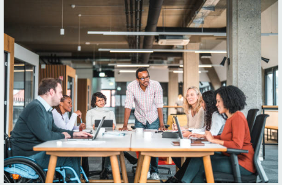
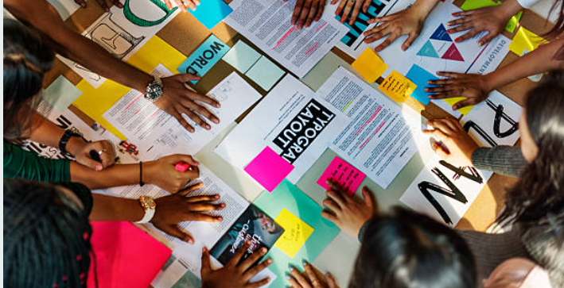

```{r setup, include=FALSE}
knitr::opts_chunk$set(echo = TRUE)
# Colores - paleta de azules
c1="#001A33"
c2="#003366"
c3="#004080"
c4="#1A8CFF"
c5="#4DA6FF"
c6="#80BFFF"
c7="#B3D9FF"

# <span style="color:#001A33"> 

## <span style="color:#003366">  

### <span style="color:#004080">
### <span style="color:#1A8CFF">
### <span style="color:#4DA6FF">
### <span style="color:#80BFFF">
### <span style="color:#B3D9FF">

```


<br/><br/>

```{r, echo=FALSE, out.width="50%", fig.align = "center"}

```

**Design Thinking** es una metodología de resolución de problemas centrada en el usuario que se utiliza para abordar desafíos complejos y fomentar la innovación. Esta metodología se originó en el ámbito del diseño de productos, pero se ha expandido a otros campos, incluyendo el diseño de servicios, la gestión empresarial y la resolución de problemas en general. Design Thinking se caracteriza por su enfoque en la empatía, la colaboración y la experimentación.

Las etapas fundamentales del proceso de Design Thinking son las siguientes:

<br/><br/>


## **Empatizar (Empathize):** 

En esta etapa, el equipo se sumerge en el mundo de los usuarios para comprender sus necesidades, deseos y desafíos. Esto implica la observación directa, la realización de entrevistas, la creación de perfiles de usuario y la empatía profunda con las personas a las que se busca servir. El objetivo es obtener una comprensión auténtica de la perspectiva del usuario.

<br/><br/>

## **Definir (Define):** 

Una vez que se han recopilado datos y se ha ganado empatía con los usuarios, se procede a definir claramente el problema o desafío a abordar. En esta etapa, se sintetizan los hallazgos de la etapa de empatía y se crea una declaración de problema (o "statement") que servirá como guía para el resto del proceso.

<br/><br/>

## **Idear (Ideate):** 

En esta fase, se fomenta la generación de ideas creativas y soluciones innovadoras. Los miembros del equipo, a menudo en sesiones de lluvia de ideas (brainstorming), proponen una amplia variedad de soluciones posibles sin juzgarlas. La creatividad es fundamental, y se anima a pensar más allá de lo convencional.

<br/><br/>

## **Prototipar (Prototype):** 

Una vez que se han identificado algunas ideas prometedoras en la etapa de ideación, se procede a la creación de prototipos rápidos y económicos de esas soluciones. Estos prototipos pueden ser simples representaciones visuales o modelos funcionales. El objetivo es tener algo tangible para probar y refinar.

<br/><br/>

## **Probar (Test):** 

En esta etapa, se ponen los prototipos en manos de los usuarios para obtener retroalimentación real. La retroalimentación de los usuarios es crucial para comprender cómo las soluciones propuestas se ajustan a las necesidades y expectativas de los usuarios. El proceso de prueba es iterativo, lo que significa que se pueden realizar ajustes en función de la retroalimentación y volver a probar iterativamente.

<br/><br/>

## **Implementar (Implement):** 

Una vez que se ha refinado y validado una solución a través del proceso de prueba, se procede a la implementación final. Esto puede incluir la puesta en marcha de la solución a gran escala, la planificación de la ejecución y la gestión de los recursos necesarios.

<br/><br/>

El proceso de **Design Thinking** es altamente iterativo, lo que significa que las etapas no necesariamente se siguen en un orden lineal. En lugar de eso, se pueden retroceder y avanzar entre las etapas según sea necesario para perfeccionar la solución. Design Thinking se basa en la colaboración y la creatividad, y se centra en la resolución de problemas de manera holística, teniendo en cuenta tanto las necesidades de los usuarios como las oportunidades de innovación. Es una metodología poderosa para abordar una amplia variedad de desafíos en diferentes contextos.


<br/><br/><br/>

## **Ejemplo 1**:


```{r, echo=FALSE, out.width="50%", fig.align = "center"}

```

<br/><br/>

### **Problema:** 

* El banco ha notado que muchos clientes tienen dificultades para navegar por su sitio web y realizar operaciones en línea de manera eficiente, lo que ha llevado a una disminución en la satisfacción del cliente y un aumento en las consultas de soporte.


<br/><br/>

### **1. Empatizar:**

* El equipo de Design Thinking se sumerge en la experiencia de los clientes. Realizan entrevistas con usuarios reales para comprender sus frustraciones y desafíos al utilizar el sitio web del banco.

* Observan cómo los clientes interactúan con el sitio web y recopilan datos sobre las áreas de mayor confusión y dificultad.

* Entrevistan al personal de atención al cliente para obtener información sobre los problemas más comunes reportados por los clientes.

<br/><br/>

### **2. Definir:**

* A partir de la información recopilada en la etapa de empatía, el equipo define el problema central: "Los clientes tienen dificultades para navegar y utilizar eficientemente el sitio web del banco, lo que resulta en una disminución de la satisfacción del cliente y un aumento en las consultas de soporte".

<br/><br/>

### **3. Idear:**

* En una sesión de ideación, el equipo de Design Thinking genera una serie de ideas creativas para abordar el problema, como una interfaz de usuario más intuitiva, tutoriales interactivos, un chatbot de asistencia en línea, y una revisión de la estructura de menús del sitio web.

<br/><br/>

### **4. Prototipar:**

* El equipo selecciona una de las ideas, por ejemplo, la creación de una interfaz de usuario más intuitiva. Luego, crean prototipos de esta nueva interfaz utilizando herramientas de diseño. Estos prototipos son simples representaciones visuales de la nueva interfaz.

<br/><br/>

### **5. Probar:**

* Los prototipos se prueban con un grupo de clientes seleccionados al azar. Los usuarios interactúan con la nueva interfaz y proporcionan retroalimentación en tiempo real.

* Se recopila retroalimentación sobre la usabilidad, la claridad y la eficiencia de la nueva interfaz.

<br/><br/>

### **6. Implementar:**

* Basándose en la retroalimentación de los usuarios y los hallazgos de las pruebas, el equipo de Design Thinking finaliza la nueva 
interfaz y trabaja con el equipo de desarrollo para implementarla en el sitio web del banco.

* Se comunican los cambios a los clientes y se proporciona soporte adicional para ayudarlos a familiarizarse con la nueva interfaz.

<br/><br/>

El proceso de Design Thinking ha permitido al banco abordar de manera efectiva el problema de usabilidad en su sitio web, mejorando la experiencia del cliente y reduciendo la carga de trabajo del equipo de soporte. Además, este enfoque enfocado en el usuario ha llevado a una solución más centrada en las necesidades de los clientes.


<br/><br/><br/>

## **Evaluación** 

**Ordena** las siguientes actividades orientadas a resolver el siguiente problema:

<br/>

### **Problema:** 


```{r, echo=FALSE, out.width="50%", fig.align = "center"}

```

La oficina bancaria ha notado una disminución en la colaboración y comunicación efectiva entre los empleados, lo que ha llevado a un menor rendimiento y una disminución de la moral del equipo.

El proceso de **Design Thinking** permitirá a la oficina bancaria abordar de manera efectiva el problema de la falta de colaboración interna, mejorando el ambiente de trabajo y el rendimiento de los empleados. Además, este enfoque ha fomentado una cultura de innovación y mejora continua dentro de la organización.


<br/><br/>

### **1.**

* El equipo selecciona una de las ideas, por ejemplo, la creación de espacios comunes de trabajo. Luego, crea prototipos de cómo podrían ser estos espacios, considerando la disposición del mobiliario, la tecnología y la comunicación visual.

<br/><br/>


### **2.**

* Se instalan versiones piloto de los espacios comunes de trabajo en una parte de la oficina.

* Los empleados tienen la oportunidad de utilizar estos espacios y proporcionar retroalimentación sobre su utilidad y comodidad.

<br/><br/>


### **3.**

* A partir de la información recopilada en la etapa de empatía, el equipo define el problema central: "La falta de colaboración y comunicación efectiva entre los empleados está afectando negativamente el rendimiento y la moral del equipo en la oficina bancaria".

<br/><br/>


### **4.**

* En una sesión de ideación, el equipo de Design Thinking genera una serie de ideas creativas para abordar el problema, como la creación de espacios comunes de trabajo, la implementación de reuniones regulares de colaboración interdepartamental, la introducción de herramientas de comunicación interna y la realización de eventos para fomentar el trabajo en equipo.

<br/><br/>


## **6.**

* El equipo de Design Thinking realiza entrevistas y encuestas con los empleados de la oficina para comprender sus desafíos y frustraciones en relación con la colaboración y la comunicación.

* Observan cómo los empleados interactúan en el entorno de trabajo y recopilan información sobre los obstáculos a la colaboración efectiva.

* Se reúnen con diferentes equipos y departamentos para obtener perspectivas variadas.


### **5**

* Basándose en la retroalimentación de los empleados y los hallazgos de las pruebas, se finaliza el diseño de los espacios comunes de trabajo.

* Se implementan estos espacios en toda la oficina bancaria y se comunican los cambios a los empleados.

* Se establece un plan de seguimiento para evaluar continuamente el impacto de los nuevos espacios en la colaboración y la moral del equipo.

<br/><br/>

**Solución** : 6,3,4,1,2,5


---------------------------------------------------------------------------------
<!-- ### **1. Empatizar:** -->

<!-- * El equipo de Design Thinking realiza entrevistas y encuestas con los empleados de la oficina para comprender sus desafíos y frustraciones en relación con la colaboración y la comunicación. -->

<!-- * Observan cómo los empleados interactúan en el entorno de trabajo y recopilan información sobre los obstáculos a la colaboración efectiva. -->

<!-- * Se reúnen con diferentes equipos y departamentos para obtener perspectivas variadas. -->

<!-- <br/><br/> -->

<!-- ### **2. Definir:** -->

<!-- * A partir de la información recopilada en la etapa de empatía, el equipo define el problema central: "La falta de colaboración y comunicación efectiva entre los empleados está afectando negativamente el rendimiento y la moral del equipo en la oficina bancaria". -->

<!-- <br/><br/> -->

<!-- ### **3. Idear:** -->

<!-- * En una sesión de ideación, el equipo de Design Thinking genera una serie de ideas creativas para abordar el problema, como la creación de espacios comunes de trabajo, la implementación de reuniones regulares de colaboración interdepartamental, la introducción de herramientas de comunicación interna y la realización de eventos para fomentar el trabajo en equipo. -->

<!-- <br/><br/> -->

<!-- ### **4. Prototipar:** -->

<!-- * El equipo selecciona una de las ideas, por ejemplo, la creación de espacios comunes de trabajo. Luego, crea prototipos de cómo podrían ser estos espacios, considerando la disposición del mobiliario, la tecnología y la comunicación visual. -->

<!-- <br/><br/> -->

<!-- ### **5. Probar:** -->

<!-- * Se instalan versiones piloto de los espacios comunes de trabajo en una parte de la oficina. -->

<!-- * Los empleados tienen la oportunidad de utilizar estos espacios y proporcionar retroalimentación sobre su utilidad y comodidad. -->

<!-- <br/><br/> -->

<!-- ### **6. Implementar:** -->

<!-- * Basándose en la retroalimentación de los empleados y los hallazgos de las pruebas, se finaliza el diseño de los espacios comunes de trabajo. -->

<!-- * Se implementan estos espacios en toda la oficina bancaria y se comunican los cambios a los empleados. -->

<!-- * Se establece un plan de seguimiento para evaluar continuamente el impacto de los nuevos espacios en la colaboración y la moral del equipo. -->

<!-- <br/><br/> -->


```{r, echo=FALSE, out.width="50%", fig.align = "center"}

```


<br/><br/>