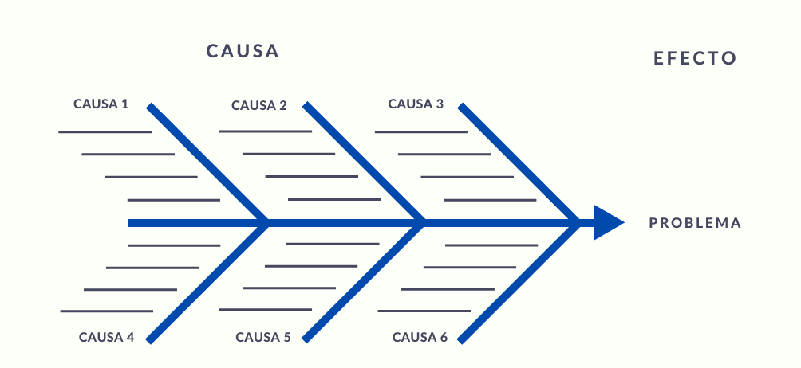
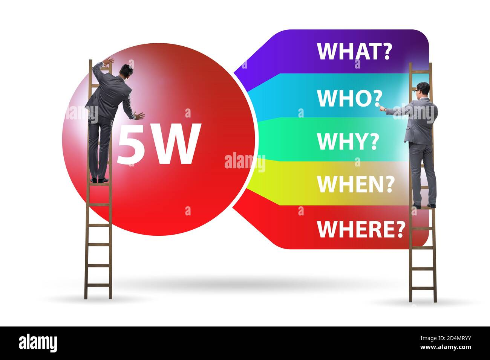
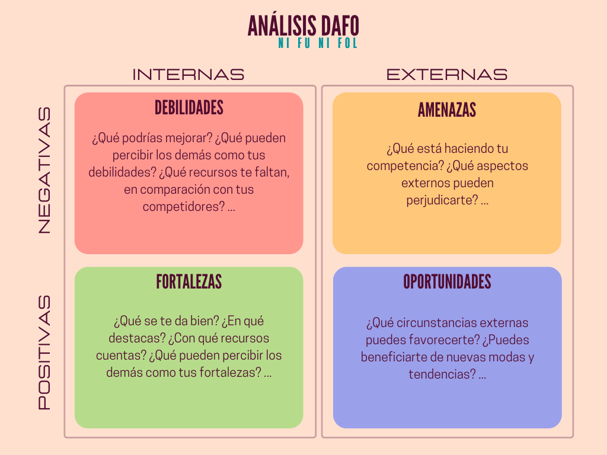

```{r setup, include=FALSE}
knitr::opts_chunk$set(echo = TRUE)
# Colores - paleta de azules
c1="#001A33"
c2="#003366"
c3="#004080"
c4="#1A8CFF"
c5="#4DA6FF"
c6="#80BFFF"
c7="#B3D9FF"

# <span style="color:#001A33"> 

## <span style="color:#003366">  

### <span style="color:#004080">
### <span style="color:#1A8CFF">
### <span style="color:#4DA6FF">
### <span style="color:#80BFFF">
### <span style="color:#B3D9FF">

```

<br/><br/>

La identificación de causas es un proceso fundamental en la resolución de problemas y la toma de decisiones. Para identificar causas de manera efectiva, existen varias técnicas que puedes emplear, dependiendo del contexto y la complejidad del problema. Aquí tienes algunas técnicas comunes:

<br/><br/>

## **Diagrama de Ishikawa (o Diagrama de Espina de Pescado):** 


```{r, echo=FALSE, out.width="50%", fig.align = "center"}

```

También conocido como "Diagrama de Causa y Efecto", este método visual ayuda a identificar las posibles causas de un problema al mapearlas en una estructura similar a la espina de un pez. Categorías comunes de causas incluyen personas, procesos, equipo, entorno y materiales.

<br/><br/>


## **5 Por qué (5 Whys):** 


```{r, echo=FALSE, out.width="30%", fig.align = "center"}

```

Esta técnica consiste en hacer repetidamente la pregunta "¿Por qué?" para profundizar en las causas de un problema. Cada respuesta a la pregunta inicial se convierte en una nueva pregunta "¿Por qué?", lo que ayuda a descubrir las causas fundamentales.

<br/><br/>


## **Análisis FODA (Fortalezas, Oportunidades, Debilidades, Amenazas):** 


```{r, echo=FALSE, out.width="50%", fig.align = "center"}

```

Esta técnica se utiliza para analizar problemas o situaciones desde cuatro perspectivas: fortalezas, oportunidades, debilidades y amenazas. Al identificar las debilidades, puedes determinar sus causas.

<br/><br/>


## **Matriz Causa-Efecto (Matriz de relaciones interfuncionales):** 


Esta técnica involucra la creación de una matriz que muestra las relaciones entre diversas variables. Ayuda a identificar las interacciones entre factores y sus efectos en un problema.

<br/><br/>

## **Método de Pareto:** 

El principio de Pareto establece que un pequeño número de causas (20%) suele ser responsable del mayor porcentaje de problemas (80%). Esta técnica te ayuda a identificar y priorizar las causas más significativas.

<br/><br/>


## **Entrevistas y Encuestas:** 

La comunicación con expertos y partes interesadas puede proporcionar información valiosa sobre las causas de un problema. Las entrevistas estructuradas y las encuestas son útiles para recopilar datos.

<br/><br/>

## **Análisis de Datos y Estadísticas:** 

El análisis de datos cuantitativos puede ayudar a identificar correlaciones y relaciones entre variables que podrían ser causas de un problema. El uso de herramientas estadísticas como análisis de regresión y análisis de tendencias puede ser útil.

<br/><br/>

## **Análisis de Procesos:** 

En problemas relacionados con procesos, el análisis de flujo de trabajo y la identificación de cuellos de botella pueden revelar causas subyacentes.

<br/><br/>


## **Brainstorming:** 

La lluvia de ideas puede ser utilizada no solo para la generación de soluciones, sino también para la identificación de posibles causas de un problema.

<br/><br/>

## **Mapeo de Ruta de Valor (Value Stream Mapping):** 

Es una técnica que se utiliza comúnmente en la gestión Lean para identificar ineficiencias y desperdicios en procesos, ayudando a identificar las causas subyacentes.

<br/><br/>

## **Diagramas de Árbol de Problemas:** 

Esta técnica se utiliza en la metodología del Marco Lógico y se enfoca en identificar las causas y efectos de un problema a través de la construcción de un diagrama jerárquico.

<br/><br/>

## **Diagrama de Flechas (Arrow Diagramming Method - ADM):** 

Utilizado en la gestión de proyectos, el ADM ayuda a identificar las relaciones entre tareas y eventos en un proyecto, lo que puede revelar causas de retrasos o problemas.

<br/><br/>


La elección de la técnica adecuada depende del tipo de problema que estás abordando y de tus recursos disponibles. A menudo, es útil combinar varias de estas técnicas para obtener una visión más completa de las causas subyacentes de un problema.


