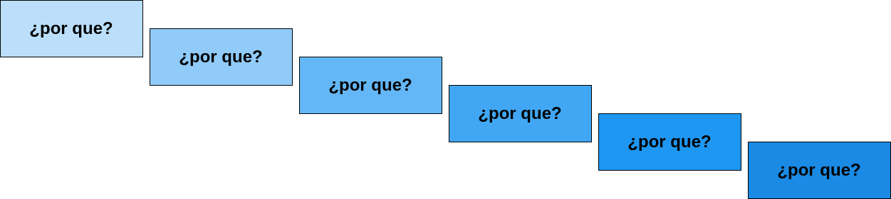
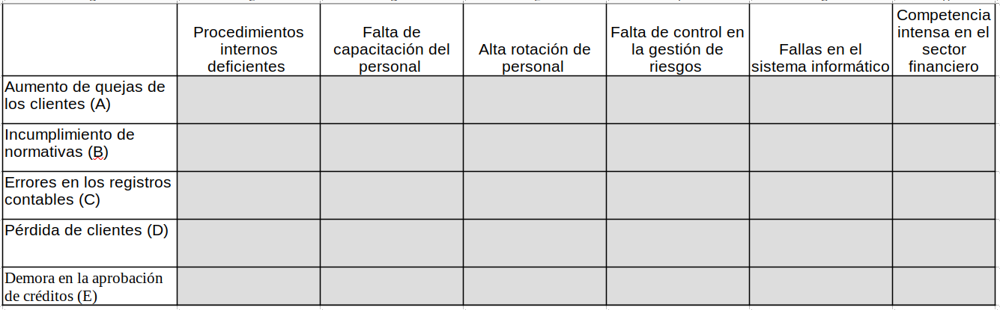
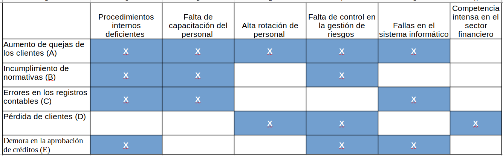

```{r setup, include=FALSE}
knitr::opts_chunk$set(echo = TRUE)
# Colores - paleta de azules
c1="#001A33"
c2="#003366"
c3="#004080"
c4="#1A8CFF"
c5="#4DA6FF"
c6="#80BFFF"
c7="#B3D9FF"

# <span style="color:#001A33"> 

## <span style="color:#003366">  

### <span style="color:#004080">
### <span style="color:#1A8CFF">
### <span style="color:#4DA6FF">
### <span style="color:#80BFFF">
### <span style="color:#B3D9FF">

```

<br/><br/>

La identificación de causas es un proceso fundamental en la resolución de problemas y la toma de decisiones. Para identificar causas de manera efectiva, existen varias técnicas que puedes emplear, dependiendo del contexto y la complejidad del problema. Aquí tienes algunas técnicas comunes:

<br/><br/>

## **Diagrama de Ishikawa (o Diagrama de Espina de Pescado):** 


```{r, echo=FALSE, out.width="80%", fig.align = "center"}
knitr::include_graphics("img/espinapescado.png")
```

También conocido como "Diagrama de Causa y Efecto", este método visual ayuda a identificar las posibles causas de un problema al mapearlas en una estructura similar a la espina de un pez. Categorías comunes de causas incluyen personas, procesos, equipo, entorno y materiales.


### Evaluación

Una entidad financieraha  está interesada en identificar tanto causas como efectos que podrían estar afectando sus operaciones. A continuación, se presenta una lista de causas numeradas del 1 al 5 y una lista de efectos identificados con letras de la "a" a la "e". 

Empareje  cada número con su correspondiente letra, indicando así la relación entre las causas y los efectos.

<div class="content-box-yellow">
**Causas**:

1. Falta de capacitación del personal
2. Falta de control en la gestión de riesgos
3. Procedimientos internos deficientes
4. Alta rotación de personal
5. Fallas en el sistema informático

**Efectos**:

a. Demora en la aprobación de créditos
b. Pérdida de clientes
c. Incumplimiento de normativas
d. Errores en los registros contables
e. Aumento de quejas de los clientes

</div>

Respuesta:

1 - a  ; 2 - e ; 3 - c ; 4 - b;  5 - d

<br/><br/><br/><br/>


## **5 Por qué (5 Whys):** 


```{r, echo=FALSE, out.width="100%", fig.align = "center"}

```

Esta técnica consiste en hacer repetidamente la pregunta "¿Por qué?" para profundizar en las causas de un problema. Cada respuesta a la pregunta inicial se convierte en una nueva pregunta "¿Por qué?", lo que ayuda a descubrir las causas fundamentales.

<br/><br/>


### Ejemplo

Problema: Los clientes se quejan de que el proceso de apertura de cuentas bancarias es demasiado largo.

<div class="content-box-yellow">
P1 : ¿Por qué el proceso de apertura de cuentas bancarias es largo?
</div>

* Porque se requiere que los clientes presenten muchos documentos.

<br/><br/>

<div class="content-box-yellow">
P2 : ¿Por qué se requiere que los clientes presenten muchos documentos?
</div>

* Porque el banco tiene políticas estrictas de cumplimiento normativo para verificar la identidad y prevenir el lavado de dinero.

<br/><br/>

<div class="content-box-yellow">
P3 : ¿Por qué el banco tiene políticas estrictas de cumplimiento normativo?
</div>

* Porque es un requisito regulatorio impuesto por las autoridades financieras para garantizar la transparencia y seguridad en las transacciones financieras.

<br/><br/>

<div class="content-box-yellow">
P4 : ¿Por qué las autoridades financieras imponen este requisito regulatorio?
</div>

* Porque ha habido casos de fraude y lavado de dinero en el pasado que han afectado la integridad del sistema financiero.

<div class="content-box-yellow">
P5 : ¿Por qué ha habido casos de fraude y lavado de dinero en el pasado?
</div>

* Porque los controles anteriores eran insuficientes para detectar y prevenir actividades ilícitas.

<br/><br/><br/><br/>


## **Análisis FODA (Fortalezas, Oportunidades, Debilidades, Amenazas):** 

Esta técnica se utiliza para analizar problemas o situaciones desde cuatro perspectivas: fortalezas, oportunidades, debilidades y amenazas. Al identificar las debilidades, puedes determinar sus causas.

<br/>

### Ejemplo

<br/>

div class="content-box-blue">

| Fortalezas (F)                                                          | Oportunidades (O)                                                    |
|:----------------------------------------------------------------------|:-----------------------------------------------------------------------|
|Amplia gama de productos y servicios financieros.                      | Crecimiento económico en el mercado objetivo.                          |
|Alta solidez financiera y credibilidad en el mercado.                  | Avances tecnológicos que permiten innovar en productos y servicios.    |
|Uso eficiente de la tecnología para mejorar la experiencia del cliente.| Cambios regulatorios que podrían abrir nuevos mercados.                |
|Personal altamente capacitado y comprometido.                          | Mayor conciencia sobre la importancia de la planificación financiera.  |
|Buena reputación y relaciones sólidas con clientes e inversores.       |                                                                        |

| Debilidades (D)                                                      |    Amenazas (A)                                                         |
|:---------------------------------------------------------------------|:------------------------------------------------------------------------|
|Dependencia excesiva de fuentes de financiamiento externo.            | Competencia intensa en el sector financiero.                            |
|Limitaciones en la agilidad y flexibilidad de los procesos internos.  | Cambios en las tasas de interés que podrían afectar la rentabilidad.    |
|Necesidad de mejorar la gestión del riesgo crediticio.                | Inestabilidad económica a nivel nacional o global.                      |
|Escasa diversificación de productos en comparación con la competencia.| Avances tecnológicos que podrían dejar obsoletos los servicios actuales.|

</div>

<br/>

**Conclusión:**

La entidad financiera tiene una base sólida con una amplia gama de productos y servicios, así como un personal capacitado y tecnología eficiente. Sin embargo, debe abordar sus debilidades, como la dependencia de financiamiento externo y la necesidad de mejorar la gestión del riesgo crediticio, para aprovechar las oportunidades del mercado y hacer frente a las amenazas de la competencia y los cambios económicos.

<br/><br/><br/><br/>

### **Matriz Causa-Efecto (Matriz de relaciones interfuncionales): **

Esta técnica involucra la creación de una matriz que muestra las relaciones entre diversas variables. Ayuda a identificar las interacciones entre factores y sus efectos en un problema.


### Evaluación

En la siguiente Matriz marca las relaciones que consideres puedan existir entre las Causas (primera columna) y los efectos (primera fila)


```{r, echo=FALSE, out.width="100%", fig.align = "center"}

```


Solución

```{r, echo=FALSE, out.width="100%", fig.align = "center"}

```

<br/><br/>

### **Método de Pareto:** 

El principio de Pareto establece que un pequeño número de causas (20%) suele ser responsable del mayor porcentaje de problemas (80%). Esta técnica te ayuda a identificar y priorizar las causas más significativas.

El método de Pareto podría aplicarse para identificar y priorizar los problemas o áreas de mejora que tienen el mayor impacto en la satisfacción del cliente o en la eficiencia operativa. 

### Ejemplo

Una entidad bancaria podría utilizar el método de Pareto para identificar los problemas más comunes que enfrentan los clientes al utilizar sus servicios, como largos tiempos de espera en las sucursales o dificultades con los servicios en línea. Para identificar y priorizar los problemas de satisfacción del cliente, se recopila información, se genera el diagrama de Pareto

```{r, echo=FALSE}
# Instalar y cargar la librería qcc
# install.packages("qcc")
library(qcc)

# Datos de ejemplo (quejas de clientes)
quejas <- c("Tiempo de espera", "Problemas con el sistema en línea", "Cargos inesperados", "Servicio al cliente insatisfactorio", "Problemas de seguridad")
frecuencia <- c(150, 80, 25, 10, 5)
datos_quejas <- data.frame(quejas, frecuencia)

# Crear el gráfico de Pareto
pareto.chart(datos_quejas$frecuencia, main = "Análisis de Pareto de quejas de clientes en un banco", ylab = "Frecuencia", col = "skyblue", las=1)

```

A : Tiempo de espera 
B : Problemas con el sistema en línea 
C : Cargos inesperados 
D : Servicio al cliente insatisfactorio 
E : Problemas de seguridad

El 85% de las quejas se concentra en los dos primeros items ( A:Tiempo de espera y  
B : Problemas con el sistema en línea).   


<br/><br/><br/><br/>


### **Brainstorming:** 

La lluvia de ideas puede ser utilizada no solo para la generación de soluciones, sino también para la identificación de posibles causas de un problema.


```{r, echo=FALSE, out.width="100%", fig.align = "center"}

```

<br/><br/><br/>


La elección de la técnica adecuada depende del tipo de problema que estás abordando y de tus recursos disponibles. A menudo, es útil combinar varias de estas técnicas para obtener una visión más completa de las causas subyacentes de un problema.


### **Evaluación**


#### **Situación 1** :

Una entidad financiera está experimentando un aumento en las quejas de los clientes debido a errores en los registros contables. ¿Qué metodología sería más adecuada para identificar las causas de estos errores?

- a) Análisis DOFA  (No,  La metodología permite identificar las posibles causas de un problema es el Diagrama de Ishikawa)
- b) Diagrama de Ishikawa (Correcto, Esta metodología permite identificar las posibles causas de un problema)
- c) Método de Pareto (No,  La metodología permite identificar las posibles causas de un problema es el Diagrama de Ishikawa)
- d) Brainstorming  (No,  La metodología permite identificar las posibles causas de un problema es el Diagrama de Ishikawa)
- (Respuesta correcta: b)

#### **Situación 2 **:

Un banco ha identificado una disminución en la satisfacción de los clientes y desea analizar las causas subyacentes. ¿Qué metodología podría ayudar en este análisis?

- a) Análisis DOFA (No, La metodología que permite profundizar en las causas de un problema es la metodología de 5 Por qué)
- b) Diagrama de Ishikawa (No, La metodología que permite profundizar en las causas de un problema es la metodología de 5 Por qué)
- c) 5 Por Qué (Correcto, La metodología que permite profundizar en las causas de un problema es la metodología de 5 Por qué))
- d) Método de Pareto (No, La metodología que permite profundizar en las causas de un problema es la metodología de 5 Por qué)
- (Respuesta correcta: c)

#### **Situación 3** :

Una institución financiera está evaluando su posición en el mercado y las posibles amenazas y oportunidades. ¿Qué metodología podría utilizar para este análisis?

- a) Análisis DOFA (Correcto, El Análisis DOFA es la metodología apropiada para la evaluación posición el mercado y las posibilidades, amenazas y oportunidades)
- b) Diagrama de Ishikawa (No, Es el Análisis DOFA  la metodología apropiada para la evaluación posición el mercado y las posibilidades, amenazas y oportunidades)
- c) Método de Pareto (No, Es el Análisis DOFA  la metodología apropiada para la evaluación posición el mercado y las posibilidades, amenazas y oportunidades)
- d) Brainstorming (No, Es el Análisis DOFA  la metodología apropiada para la evaluación posición el mercado y las posibilidades, amenazas y oportunidades)
- (Respuesta correcta: a)

#### **Situación 4** :

Un banco desea identificar las principales áreas de mejora en sus procesos internos. ¿Qué metodología podría ayudar en este análisis?

- a) Análisis DOFA (No, la metodogía que nos permite identificar las principales áreas de mejora es el Método de Pareto)
- b) Diagrama de Ishikawa (No, la metodogía que nos permite identificar las principales áreas de mejora es el Método de Pareto)
- c) Método de Pareto (Correcto, la metodología de Pareto permite detectar las principales áreas de mejora con mayor impacto)
- d) Brainstorming (No, la metodogía que nos permite identificar las principales áreas de mejora es el Método de Pareto)
- (Respuesta correcta: c)

#### **Situación 5** : 

Una entidad financiera está buscando nuevas ideas para mejorar la satisfacción del cliente. ¿Qué metodología podría utilizar para generar estas ideas?

- a) Análisis DOFA (No, la metodología que prioriza la lluvia de ideas para la generación de soluciones al rededor de un problema es Brainstorming)
- b) Diagrama de Ishikawa (No, la metodología que prioriza la lluvia de ideas para la generación de soluciones al rededor de un problema es Brainstorming)
- c) Método de Pareto (No, la metodología que prioriza la lluvia de ideas para la generación de soluciones al rededor de un problema es Brainstorming)
- d) Brainstorming (Correcto,  esta metodología propicia la generación de lluvia de ideas para la solución de problemas )
- (Respuesta correcta: d)


