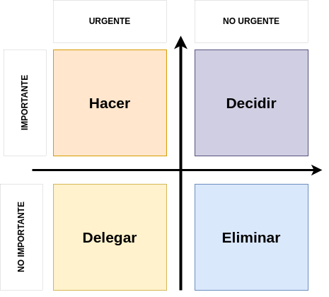
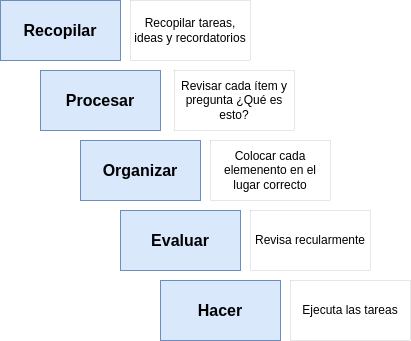
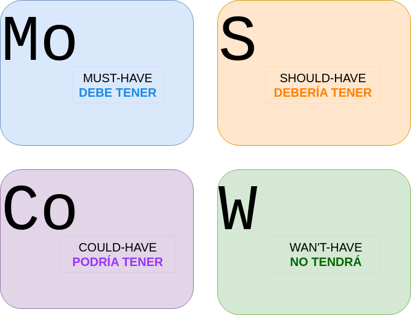

```{r setup, include=FALSE}
knitr::opts_chunk$set(echo = TRUE)
# Colores - paleta de azules
c1="#001A33"
c2="#003366"
c3="#004080"
c4="#1A8CFF"
c5="#4DA6FF"
c6="#80BFFF"
c7="#B3D9FF"

# <span style="color:#001A33"> 

## <span style="color:#003366">  

### <span style="color:#004080">
### <span style="color:#1A8CFF">
### <span style="color:#4DA6FF">
### <span style="color:#80BFFF">
### <span style="color:#B3D9FF">

```

<br/><br/>

La organización de prioridades es fundamental en la gestión del tiempo y la toma de decisiones. Existen diversas metodologías y enfoques que puedes emplear para priorizar tareas, proyectos o actividades de manera efectiva. Aquí tienes algunas de las metodologías más comunes:

<br/><br/>

## **Matriz de Eisenhower:** 

<br/>

```{r, echo=FALSE, out.width="50%", fig.align = "center"}

```


<br/><br/>

Popularizada por el ex presidente de los Estados Unidos, Dwight D. Eisenhower, esta matriz clasifica las tareas en cuatro cuadrantes según su importancia y urgencia. Las tareas se dividen en cuadrantes de "Urgente e Importante", "No Urgente pero Importante", "Urgente pero No Importante" y "Ni Urgente ni Importante". Esto ayuda a priorizar las tareas según su impacto y tiempo restante.


### Ejemplo


<br/><br/>

##  **Método GTD (Getting Things Done):** 

Desarrollado por David Allen, GTD es una metodología de gestión del tiempo que se centra en la organización de tareas y proyectos en listas, llamadas "Banders de Tareas". GTD se basa en capturar, aclarar, organizar, reflejar y comprometerse con las tareas.

<br/>

```{r, echo=FALSE, out.width="70%", fig.align = "center"}

```


### Ejemplo

<br/><br/>

##  **MoSCoW:** 

Utilizado comúnmente en la gestión de proyectos, MoSCoW se refiere a Must (Deben), Should (Deberían), Could (Podrían) y Won't (No lo harán). Las tareas se clasifican en estas categorías para definir sus prioridades.

<br/>

```{r, echo=FALSE, out.width="70%", fig.align = "center"}

```
### Ejemplo


<br/><br/>


<br/><br/>

## **Reto 1-3-5:** 

Consiste en seleccionar una tarea importante, tres tareas medianamente importantes y cinco tareas menos importantes para abordar en un día determinado. Esto ayuda a priorizar y limitar el número de tareas diarias.

<br/><br/>


## **Método ABCD:** 

Las tareas se dividen en cuatro categorías: A (urgente e importante), B (importante pero no urgente), C (urgente pero no importante) y D (ni urgente ni importante). Las tareas se priorizan en función de su categoría.

<br/><br/>


